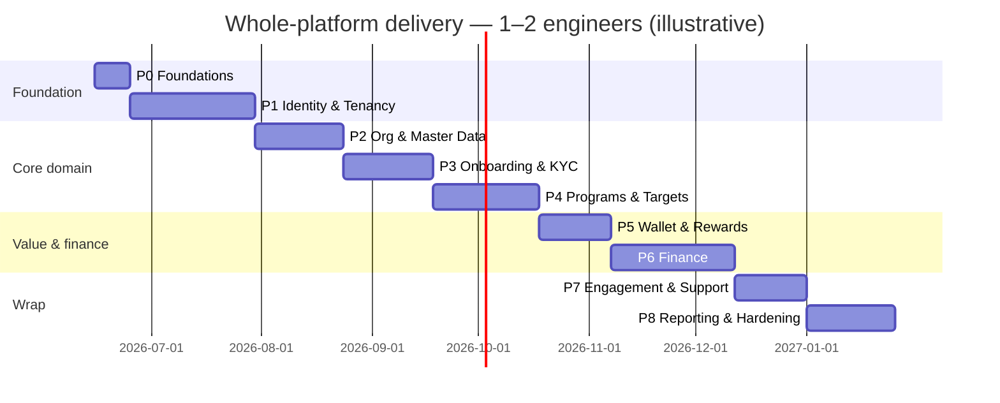

# Master Implementation Plan — the entire platform

A phased, bite-sized plan to deliver the **whole Loyaltybase platform** to the
[spec](../spec/README.md), for an engineer new to this codebase. This is the **top-level plan**:
it covers all 17 bounded contexts and 6 core workflows, sequenced into 9 phases. The 28
[gaps](../spec/gap-register.md) are **absorbed into the phase where their context is built** — they
are not a separate track.

> **Read first:** [`00-onboarding.md`](00-onboarding.md) (toolset, domain, env, git) and
> [`01-how-we-test.md`](01-how-we-test.md) (test design). Every task assumes them.
> **Depth:** this doc is task-level (what, files, test, DoD). The deepest code-level walkthroughs
> (like [`03-milestone-B-points-to-wallet.md`](03-milestone-B-points-to-wallet.md)) are expanded
> per phase on request — that file is the **worked example** of the depth each task gets.

## How the existing build is treated (per context, not up front)

The platform is **partially built**. Do **not** rebuild from scratch, and do **not** assume the
spec equals the code. Every context begins with a fixed first task:

> **Task X.0 — Reconcile.** Audit what exists for this context against the spec (½–1 day). Tag each
> capability **BUILD** (missing), **COMPLETE** (partial/stubbed/`DEMO_MODE`), or **VERIFY** (looks
> done — prove it with a test). Record build-vs-complete-vs-reuse decisions in the PR. *Plan against
> the spec, build against the code — if they disagree, the code wins and the spec is corrected.*

So "consider the existing build" happens **just-in-time at each context**, not as one big up-front
audit (that up-front work is already the spec + gap register).

## Conventions (full detail in onboarding)
TDD (RED→GREEN→REFACTOR) · DRY (search for a helper before writing one) · YAGNI · frequent small
commits · conventional-commit messages · **every DB query scoped by `clientId`** · never commit secrets.

## Phase overview

| Phase | Theme | Bounded contexts | Gaps absorbed | Rough duration |
|---|---|---|---|---|
| **P0** | Foundations & shared infra | cross-cutting | #1, #21 | 1–2 wk |
| **P1** | Identity, tenancy & access | Identity & Access · Tenancy/Config | #2, #3, #20, #22, #23 | 4–6 wk |
| **P2** | Organization & master data | Sales Org · Partners/Outlets · Catalog | #4, #11 | 3–5 wk |
| **P3** | Onboarding & KYC | KYC & Enrollment | #9, #12, #13, #14, #15 | 3–5 wk |
| **P4** | Programs, targets & enrollment | Schemes/Activations · Targets | #6, #10 | 4–6 wk |
| **P5** | Wallet, points & rewards | Wallet & Points · Rewards | #28 | 3–4 wk |
| **P6** | Finance: credits, payouts, visibility, invoicing | Awards&Credits · Payouts&Fund · Visibility · Invoicing | #5, #7, #8, #16, #17, #19, #25 | 5–7 wk |
| **P7** | Engagement & support | Engagement · Support | (—) | 2–4 wk |
| **P8** | Reporting, analytics, compliance & hardening | Reporting · cross-cutting | #24, #26, #27 | 3–5 wk |
| **P9** | Infra, Deployment & Go-Live (CI/CD, staging/prod, migrations, RBAC enablement, launch) — **cross-cutting track**: CI/staging early, launch at the end | cross-cutting | #23 (RLS), #27 | 3–5 wk (spread) |

**Total ≈ 28–44 weeks (~7–11 months)** for **1–2 engineers**, building on the existing partial
code (it's complete-and-correct, not build-from-zero). Ranges only — **re-estimate at each phase's
Reconcile task.** Dependencies flow top-down: P1 (auth/tenancy/RBAC) underpins everything; finance
(P6) needs wallet (P5); programs (P4) and finance (P6) need org/master-data (P2).

---

## P0 · Foundations & shared infra  (1–2 wk)
**Objective:** the app runs, CI is green, and the shared building blocks every later task reuses are
solid. **Existing build:** mostly present — this phase is mostly VERIFY + small fixes.

| Task | What | Key files / area | Test |
|---|---|---|---|
| 0.0 | Reconcile shared infra vs spec §04 | `lib/`, `app/api` | — |
| 0.1 | Confirm env + DB + DEMO_MODE; CI runs `test`+`tsc`+`lint` | `.env.example`, `package.json` | green pipeline |
| 0.2 | Verify/standardize API response helpers (`ok`/`err`) + adopt everywhere new | `lib/` shared helper | unit |
| 0.3 | Harden `getAuthUser`/`getClientIdFromRequest`; document the contract | `lib/auth.ts`, `lib/tenant.ts` | unit |
| 0.4 | Quick wins: domain refs (#1), messaging-path decision (#21), dead `ROLES` | see Milestone A | per-task |
| 0.5 | Base portal layout/nav + shared UI kit audit | `app/(portals)`, components | render |

**Exit:** fresh checkout → `npm test`/`tsc`/`lint` clean; shared helpers documented; Milestone A merged.

> **P0 status (live).** 0.0 reconcile ✅ · 0.1 env/DB + green baseline (two test lanes; dev DB validated
> through Prisma) ✅ · 0.2 `lib/api-response.ts` ok/err ✅ · 0.3 `getAuthUser` contract+tests ✅ ·
> 0.4a domain rename (gap #1 closed) ✅ · 0.4b dead `ROLES` removed ✅ · 0.4c messaging decision —
> **MSG91 = sole provider** (gap #21) ✅ · **0.5 portal layout/UI-kit ✅ signed off by user** (4 portal
> shells present + render-test-covered; *live* authenticated visual pass deferred to P1 — dev DB is
> empty/auth-gated — and will fold in the admin revamp). **→ P0 COMPLETE.** Commits
> `215a63e`/`e707879`/`102f5a5`/`23f60bd`/`09fbc3b`, local/unpushed. Inherited tree carries 105 known-red
> tests (default lane) tracked in `reconcile/baseline-red-snapshot.txt`; gate = **no NEW reds vs snapshot**.

## P1 · Identity, tenancy & access  (4–6 wk)
**Objective:** anyone can authenticate, tenants are isolated, and admin access is role-configurable.
**Existing build:** auth/OTP partial; RBAC + DB tenant model are largely BUILD.

| Task | What | Key files / area | Test |
|---|---|---|---|
| 1.0 | Reconcile Identity + Tenancy vs spec §01 #1–2 | `lib/auth.ts`, `lib/platform/*` | — |
| 1.1 | OTP send/verify + JWT issue/verify end-to-end | `api/auth/*`, `lib/auth.ts`, `lib/msg91.ts` | pure (token/otp) + flow |
| 1.2 | Sessions + `auth/me`; user CRUD + bulk-edit | `api/admin/users*`, `api/auth/me` | unit + wiring |
| 1.3 | **DB `Client`/tenant model** + backfill from `CLIENT_REGISTRY` (#22) | `prisma/schema.prisma`, `lib/platform/*` | migration + unit |
| 1.4 | Feature flags + branding read from DB; admin config UI | `api/admin/settings`, `gifsy/*` | unit + render |
| 1.5 | **Permission catalog** from capability list (#3) | `lib/rbac/*` (new) | pure |
| 1.6 | **Configurable admin roles + `can()`** gate; enforce on admin routes behind flag (#2) | `lib/rbac/can.ts`, admin routes | pure `can()` + wiring |
| 1.7 | **Tenant isolation guardrail** (audit test + Prisma scoping) (#23) | `api/__tests__`, `lib/prisma` | audit test |
| 1.8 | Token↔tenant binding design + impl w/ proxy owner (#20) | `lib/auth.ts` | pure compare |
| 1.9 | Audit log + login log writes on key actions | `lib/audit`, routes | wiring |

**Exit:** login works on a real DB; admin sees only role-permitted sections; isolation audit green;
tenant config served from DB. **Depends on:** P0.

> **P1 status — COMPLETE.** All tasks 1.0–1.9 committed + independently audited. Key outcomes:
> - **1.0** Reconcile ✅ (findings F1–F8 surfaced; per-task plan in `reconcile/P1-identity-tenancy.md`).
> - **1.1 + 1.1a** OTP converged on `msg91.ts`; one expiry path; `signToken` retired; tenant-scoped OTP lookup; fail-fast on missing templateId ✅.
> - **1.2a + 1.7 + 1.7a** `admin/users/[id]` GET/PATCH/DELETE tenant-scoped (F1 fixed); banners DELETE scoped (F6); isolation audit test (per-handler, hardened in 1.7a) ✅.
> - **1.2 + 1.8 (sessions)** Persisted `UserSession` is now the source of truth — `getAuthUser` validates it every request (revocable; 365-day sliding idle via `expiresAt` bump); `clientId` bound to session at login from the subdomain; `getAuthUser` enforces subdomain==session-tenant for non-Gifsy (GIFSY_ADMIN exempt). Closes gap #20 and the #23 header-swap. JWT now carries `userId/role/partnerId/clientId/sid` ✅.
> - **1.3 + 1.3a** DB `Client` model (id=slug, JSON config blocks, no secret, `ClientStatus` enum); additive migration applied to `gifsy_dev`; 2 rows backfilled ✅ (gap #22 addressed).
> - **1.4 + 1.4a** `getTenantConfig` reads the `Client` row (DB path); registry = edge-safe fallback; `server-only` guard; secret resolution fixed (F8) ✅.
> - **1.5** `lib/rbac/permissions.ts` — 72 permissions / 17 groups ✅ (gap #3 closed; incl. client-side `credits:request_reversal` for the reversal maker-checker).
> - **1.6a + 1.6b** `lib/rbac/can.ts` — default role→permission map + per-tenant overrides; `requirePermission` wired (additive) into all 44 admin route files / 63 handlers ✅ (gap #2 engine done). **⚠️ RBAC enforcement is flag-gated, OFF by default** (two-level: env `RBAC_ENFORCEMENT` + per-tenant `features.rbacEnforcement`). Do NOT enable without completing the pre-activation checklist in `reconcile/P1-identity-tenancy.md` §1.6.
> - **1.9** `LoginLog` + `lastLoginAt`/`loginCount` writes on successful login; atomic with the session transaction ✅.
> - **Lifecycle endpoints**: `POST /api/auth/logout`, `POST /api/auth/logout-all`, `POST /api/admin/force-logout-all` (GIFSY_ADMIN only kill switch), `GET /api/admin/settings/config`. Admin edit-phone revokes sessions on actual phone change ✅.
> - **New data model additions**: `UserSession` gained `clientId` + `lastSeenAt`; new `Client` model + `ClientStatus` enum; `FeatureFlags` gained `rbacEnforcement`.
> - **Deferred to P2/P3**: phone-change-revoke for bulk sales upload + re-KYC paths; per-tenant permission override UI; `requirePermission` caching; force-logout audit durability ordering; per-request sliding-bump write optimization.
> - **⚠️ Production note**: `DEMO_MODE` trusts `x-user-role` header by design — **never enable `DEMO_MODE` in production**.

## P2 · Organization & master data  (3–5 wk)
**Objective:** the sales org tree, partners/outlets, and product catalog exist and are manageable.

| Task | What | Key files / area | Test |
|---|---|---|---|
| 2.0 | Reconcile Sales Org + Partners/Outlets + Catalog | `lib/employee-hierarchy.ts`, `lib/outlet-*` | — |
| 2.1 | Sales hierarchy levels + reporting tree; derive role from `SalesHierarchyLevel` (#11) | `api/admin/hierarchy-config`, `admin/hierarchy` | pure tree + wiring |
| 2.2 | Sales user CRUD + outlet/partner assignment | `api/sales/team*`, `SalesUserAssignment` | unit |
| 2.3 | Partner classes + tiers + tier history | `api/admin/tiers`, `TierConfig` | unit |
| 2.4 | Partner + Outlet model; outlet master upload/upsert; finalize 1:1 binding (#4) | `lib/outlet-upload.ts`, `api/admin/outlets*` | pure parser + wiring |
| 2.5 | Outlet management UI (search/filter/deactivate/re-KYC flag) | `admin/users/outlets` | render + interaction |
| 2.6 | Product catalog: categories + SKUs | `api/admin/skus`, `Category`/`Sku` | unit |

**Exit:** an admin can build the org tree, load outlets, and manage SKUs; team views scoped correctly.
**Depends on:** P1.

## P3 · Onboarding & KYC  (3–5 wk)
**Objective:** the full enroll→KYC→approve→credential journey (spec §02 WF1) works end-to-end.

> ⚠️ **User UX revamp incoming — the Gifsy KYC-approval page is being redesigned by the user.** Task 3.0
> Reconcile must build against the **revamped** approval UX (whatever is in the code when P3 starts), not
> the current page. Coordinate before touching `sales/kyc/[id]` / approval routes.

| Task | What | Key files / area | Test |
|---|---|---|---|
| 3.0 | Reconcile KYC vs spec §02 WF1 | `lib/kyc-approval.ts`, `api/kyc/*` | — |
| 3.1 | KYC submission form + document upload (GCS) | `sales/kyc/*`, `lib/s3.ts`, `api/kyc` | wiring + pure validation |
| 3.2 | **Tree-based approval routing**, retire `ROLE_PHONES` (#9) | `lib/kyc-approval.ts` (pure `resolveApprover`) | pure (escalation) |
| 3.3 | First-approve / approve / reject routes; activate user + create wallet on approve | `api/kyc/[id]/*` | wiring + manual |
| 3.4 | **Field-level rejection** (#14); Gifsy GST/bank validation + reg-type capture (#12, #15) | `api/kyc/*`, schema | unit |
| 3.5 | Consent capture + DPDP data requests | `api/kyc/consent`, `DataRequest` | unit |
| 3.6 | **Re-KYC trigger** (#13) + SLA metrics | `api/kyc/sla-metrics` | unit |

**Exit:** an ISR can enroll an outlet, it routes up the real tree, Gifsy approves, credentials +
wallet are created. **Depends on:** P2.

## P4 · Programs, targets & enrollment  (4–6 wk)
**Objective:** activations/schemes and targets are configurable and outlets can enroll (spec §02 WF5).

| Task | What | Key files / area | Test |
|---|---|---|---|
| 4.0 | Reconcile Schemes + Targets; decide Scheme rule-engine keep/prune (#10) | `lib/schemes.ts`, `lib/targets.ts` | — |
| 4.1 | Scheme/activation CRUD + status lifecycle + eligibility/geo targeting | `api/admin/schemes*`, `Scheme*` | unit |
| 4.2 | **Configurable enrollment form** (field defs + values model) (#6) | `prisma`, `lib/enrollment-form*` | pure validation |
| 4.3 | Enrollment: self vs sales mode + conditional pre-fill (#6) | `api/schemes/[id]/enrollments` | pure prefill + wiring |
| 4.4 | Target config (wizard + Excel) | `admin/targets*`, `lib/target-excel-upload.ts` | pure parser |
| 4.5 | Achievement upload + pace; partner target view (tracking only) | `admin/sales`, `partner/targets`, `lib/pace.ts` | pure pace |

**Exit:** admin publishes an activation, eligible outlets enroll via a configurable form, targets +
achievement display. **Depends on:** P2 (audience/eligibility).

## P5 · Wallet, points & rewards  (3–4 wk)
**Objective:** points balances + redemption work (spec §02 WF4).

| Task | What | Key files / area | Test |
|---|---|---|---|
| 5.0 | Reconcile Wallet + Rewards | `lib/wallet.ts`, `lib/gifts.ts` | — |
| 5.1 | Wallet read + transactions + admin adjust | `api/wallet/*` | unit |
| 5.2 | **PointsLedger writes on credit/debit** + expiry/holding config (#28) | `lib/wallet.ts`, `PointsLedger` | pure + fake-tx |
| 5.3 | Rewards catalog + categories + inventory (Gifsy-managed) | `api/rewards/catalog*`, `admin/gifts` | unit |
| 5.4 | Redemption order + OTP confirm + status lifecycle + fulfilment | `api/rewards/redeem*`, `RedemptionOrder` | pure + wiring |
| 5.5 | Partner wallet + rewards UI | `partner/wallet`, `partner/rewards` | render |

**Exit:** a partner sees a balance, redeems with OTP, points debit, order tracks. **Depends on:** P1.

## P6 · Finance: credits, payouts, visibility, invoicing  (5–7 wk)
**Objective:** the money spine (spec §02 WF2/WF3) — uploads credit wallets, payouts settle with UTR,
visibility self-bills. **This phase contains the most High-severity gaps.**

| Task | What | Key files / area | Test |
|---|---|---|---|
| 6.0 | Reconcile all four finance contexts; lock money-unit standard (#19) | `lib/credits-payouts-*`, `lib/tds.ts` | — |
| 6.1 | Credit fields/params + batch upload + confirm | `api/admin/credits/*` | pure selector |
| 6.2 | **Credit POINTS → wallet on confirm** (#16) | Milestone B | pure + wiring |
| 6.3 | Bank download grouping: **separate-UTR for Visibility** (#7) | Milestone C / `lib/credits-download.ts` | pure grouping |
| 6.4 | UTR upload + dup detection; **reversal flow with maker-checker built into the portal** — Client Admin *requests* (`credits:request_reversal`) → Gifsy *approves/executes* (`credits:approve_reversal`, Gifsy-only) → wallet debit. Separation of duties; surface the request→approve states + reason in the reversal UI. (RBAC perms already exist, 1.6.) | `api/admin/credits/*`, reversal UI | pure + wiring |
| 6.5 | Redemption payouts + Fund ledger/receipts; **TDS sections** (#25) | `api/payouts/*`, `TdsRecord` | unit |
| 6.6 | Visibility: submit + approve + image-hash fraud; **two modes + flag** (#17) | `api/visibility/*` | pure + wiring |
| 6.7 | Self-bill invoicing + **number validation/lock** (#8); GST logic from reg-type (#15) | `api/partner/invoices/[id]`, `lib/invoice.ts` | pure validator |

**Exit:** a confirmed batch credits wallets and pays out (Visibility on its own UTR + invoice).
**Depends on:** P5 (wallet), P3 (GST reg-type), P2 (outlets).

## P7 · Engagement & support  (2–4 wk)
**Objective:** banners, notifications, leaderboard, and tickets (spec §02 WF6).

| Task | What | Key files / area | Test |
|---|---|---|---|
| 7.0 | Reconcile Engagement + Support | `lib/banner.ts`, `lib/notifications.ts`, `lib/tickets.ts` | — |
| 7.1 | Banner config (admin) + partner-app banners | `api/admin/banners`, `partner` | render |
| 7.2 | Notification engine (templates/queue/delivery) on the canonical path (#21) | `lib/notifications.ts` / `msg91.ts` | pure builders |
| 7.3 | Leaderboard config + snapshot + entries | `api/leaderboard`, `Leaderboard*` | pure ranking |
| 7.4 | Ticket lifecycle + threaded messages + escalation; SLA/routing | `api/tickets/*` | unit + wiring |

**Exit:** banners render per tenant, notifications send, leaderboard ranks, tickets flow end-to-end.

## P8 · Reporting, analytics, compliance & hardening  (3–5 wk)
**Objective:** visibility into the system + production-readiness.

> ⚠️ **User UX revamp incoming — admin dashboards and reports are being reworked by the user** (report
> *contents* will change; report-page UX is otherwise fine). Task 8.0 Reconcile builds against the
> reworked dashboards/reports. Coordinate before touching `admin/dashboards/*` and `app/api/reports/*`.

| Task | What | Key files / area | Test |
|---|---|---|---|
| 8.0 | Reconcile Reporting + cross-cutting NFRs (spec §07) | `app/api/reports/*`, `admin/dashboards` | — |
| 8.1 | Role-scoped dashboards (KYC/payments/engagement/redemptions) | `admin/dashboards/*` | render |
| 8.2 | Report endpoints + scheduled reports + exports | `api/reports/*`, `ScheduledReport` | unit |
| 8.3 | **Pagination** on all tenant-scoped list endpoints (#26) | list routes | unit |
| 8.4 | **Observability baseline** (structured logs/metrics) (#27) | `lib/`, infra | smoke |
| 8.5 | **DPDP retention/erasure policy** + implementation (#24) | `DataRequest`, `lib/` | unit |
| 8.6 | Perf pass + systemic tenant isolation (RLS/extension) finalize (#23) | `lib/prisma`, infra | audit |

**Exit:** dashboards/reports live; lists paginated; observability + retention policy in place.

## P9 · Infra, Deployment & Go-Live  (cross-cutting track + launch)
**Objective:** everything needed to actually run in production. **This is a TRACK, not a tail phase** —
the CI + staging parts (9.1–9.3) should stand up **early** (around P1–P2) so every later phase is
deploy-validated; the launch parts (9.7–9.9) gate the first real tenant.
> **Much of this ALREADY EXISTS** — so P9 is mostly RECONCILE/FINISH, not build-from-scratch:
> `.github/workflows/ci.yml` (tsc + tests on PR), `deploy-staging.yml` (`develop`→staging Cloud Run),
> `deploy.yml` (**`main`→production Cloud Run**, gated by a `test` job + a `production` environment
> manual approval), full `terraform/` (cloud-run, cloud-sql, artifact-registry, load-balancer, iam,
> `environments/gifsy.tfvars`), Cloud SQL `gifsy-db`/`gifsy-db-dev`, Secret Manager. **⚠️ KEY BLOCKER:**
> CI runs the full `npm test` and requires PASS, but our suite is **red-by-design** (~105 TDD-baseline
> failures until P8) — so the test gate fails and **no deploy proceeds via the normal path** until either
> (a) CI adopts the **differential gate** ("no NEW reds vs the snapshot") or (b) the baseline reds are
> quarantined/skipped in CI. Reconcile in 9.1. (`main`→prod also means a push to main triggers the prod
> pipeline — currently blocked only by the failing tests + the approval gate.)

| Task | What | Key area | Gate |
|---|---|---|---|
| 9.0 | Reconcile EXISTING infra (`.github/workflows/*`, `terraform/*`, `Dockerfile`, Cloud SQL, Secret Manager) vs target; list real gaps | `terraform/`, `.github/` | — |
| 9.1 | **Fix the CI gate** (`ci.yml` EXISTS): its `npm test` all-pass requirement is incompatible with the red-by-design TDD baseline → switch CI to the **differential gate** (no NEW reds vs `baseline-red-snapshot.txt`) or quarantine the baseline reds, so CI can be green and deploys can proceed | `.github/workflows/ci.yml` | CI green-able |
| 9.2 | **Environments** (`deploy-staging.yml` + terraform EXIST): verify staging is stood up & mirrors prod; confirm dev→staging→prod promotion | `terraform/`, Cloud Run | deploys |
| 9.3 | **CD** (`deploy.yml`/`deploy-staging.yml` EXIST): verify the `main`→prod (approval-gated) + `develop`→staging flows end-to-end; **add the DB-migration step** (none in the pipeline today — see 9.5) | `.github/workflows/*` | deploy run |
| 9.4 | **Secrets/env per environment**: `JWT_SECRET`, MSG91 keys, `DATABASE_URL`, `DEMO_MODE=false` in prod, RBAC flag — via Secret Manager; **never `DEMO_MODE=true` in prod** | Secret Manager | audit |
| 9.5 | **Prod DB migration process** (prod is private-IP): the diff-SQL / `db push` runbook + a `_prisma_migrations` strategy if adopting Prisma migrate; apply P0–P8 schema to prod; backups + PITR enabled | `prisma/`, Cloud SQL | dry-run on staging |
| 9.6 | **Observability/alerting** beyond logs (8.4): uptime checks, error-rate + latency alerts, DB metrics; **RLS/tenant-isolation hardening** finalize (8.6, #23) | Cloud Monitoring, `lib/prisma` | alerts fire |
| 9.7 | **Security hardening**: rate limiting, security headers, dependency/secret scanning, rotate prod creds | proxy/infra | review |
| 9.8 | **RBAC enablement** per `RBAC-ENABLEMENT.md` (validate on staging → flip `RBAC_ENFORCEMENT` in prod) | env flag | staging validation |
| 9.9 | **Launch/cutover runbook**: first-tenant onboarding + seed data, forced re-login comms, smoke tests, rollback plan, DR drill | runbook | go-live checklist |

**Exit:** CI/CD green; staging mirrors prod; prod migrated + backed up; observability + alerting live;
RBAC validated; a repeatable launch runbook. **Depends on:** runs alongside P1→P8; 9.7–9.9 before first tenant.

---

## Tracking
Use the **Phase overview** table as the top-level board (add Status/Owner columns), and each phase's
task table as the per-phase checklist. A task is done only when its tests pass and (where relevant)
a manual check on a real DB confirms it. Status legend: `⬜` / `🟡` / `🟧` / `✅`.

## Want deeper detail?
Each task above expands to a full code-level walkthrough in the style of
[`03-milestone-B-points-to-wallet.md`](03-milestone-B-points-to-wallet.md) (RED test code, GREEN
implementation, manual verification, commit). Tell me which **phase** to expand next and I'll write
its tasks at that depth into a `docs/plans/phase-N-*.md` file.
