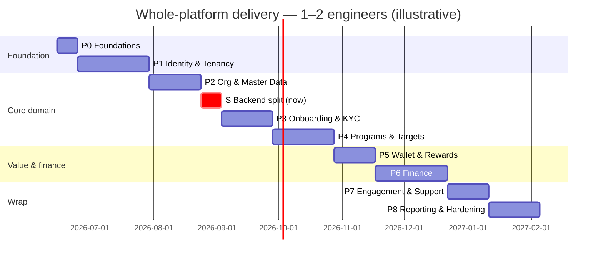

# Master Implementation Plan — the entire platform

A phased, bite-sized plan to deliver the **whole Loyaltybase platform** to the
[spec](../spec/README.md), for an engineer new to this codebase. This is the **top-level plan**:
it covers all 17 bounded contexts and 6 core workflows, sequenced into 9 phases. The 28
[gaps](../spec/gap-register.md) are **absorbed into the phase where their context is built** — they
are not a separate track.

> **Read first:** [`00-onboarding.md`](00-onboarding.md) (toolset, domain, env, git) and
> [`01-how-we-test.md`](01-how-we-test.md) (test design). Every task assumes them.
> **Depth:** this doc is task-level (what, files, test, DoD). The deepest code-level walkthroughs
> (like [`03-milestone-B-points-to-wallet.md`](03-milestone-B-points-to-wallet.md)) are expanded
> per phase on request — that file is the **worked example** of the depth each task gets.

## How the existing build is treated (per context, not up front)

The platform is **partially built**. Do **not** rebuild from scratch, and do **not** assume the
spec equals the code. Every context begins with a fixed first task:

> **Task X.0 — Reconcile.** Audit what exists for this context against the spec (½–1 day). Tag each
> capability **BUILD** (missing), **COMPLETE** (partial/stubbed/`DEMO_MODE`), or **VERIFY** (looks
> done — prove it with a test). Record build-vs-complete-vs-reuse decisions in the PR. *Plan against
> the spec, build against the code — if they disagree, the code wins and the spec is corrected.*

So "consider the existing build" happens **just-in-time at each context**, not as one big up-front
audit (that up-front work is already the spec + gap register).

## Conventions (full detail in onboarding)
TDD (RED→GREEN→REFACTOR) · DRY (search for a helper before writing one) · YAGNI · frequent small
commits · conventional-commit messages · **every DB query scoped by `clientId`** · never commit secrets.

## Phase overview

| Phase | Theme | Bounded contexts | Gaps absorbed | Rough duration |
|---|---|---|---|---|
| **P0** | Foundations & shared infra | cross-cutting | #1, #21 | 1–2 wk |
| **P1** | Identity, tenancy & access | Identity & Access · Tenancy/Config | #2, #3, #20, #22, #23 | 4–6 wk |
| **P2** | Organization & master data | Sales Org · Partners/Outlets · Catalog | #4, #11 | 3–5 wk |
| **S** ✅ | **Backend split — API-first re-architecture DONE (S0–S8)** (NestJS backend built **in place in `api/`** from platform `lib/`+schema; World-A domain deleted; thin FE via Next proxy; absorbed P4.0 World-A de-scaffold) — gated P3+, now unblocked | cross-cutting | #30, #31✅, #10, #29, #32 | ~1–2 wk |
| **P3** ✅ | **Onboarding & KYC — DONE (3.0–3.6)** (enroll→route→verify→approve→activate→re-KYC, backend-owned + thin FE; two-lane field-level KYC; built plan→execute→audit, 129 tests, browser-verified) | KYC & Enrollment | #9✅, #12✅, #13✅, #14✅, #15✅ | 3–5 wk |
| **P4** ✅ | Programs, targets & enrollment (DONE 2026-06-17) | Schemes/Activations · Targets | #6, #10, #29 | 4–6 wk |
| **P5** ✅ | **Wallet, points & rewards — DONE (5.0–5.5)** (ledger-aware wallet primitives + PointsLedger/expiry [#28]; real RewardCatalog CRUD [retired gift blob]; redeem→OTP→debit→lifecycle+refund+fulfilment; partner+admin FE; money-path audits caught real double-spend/oversell) | Wallet & Points · Rewards | #28 | 3–4 wk |
| **P6** ✅ | **Finance: credits, payouts, visibility, invoicing — DONE (6.0–6.7, backend)** | Awards&Credits · Payouts&Fund · Visibility · Invoicing | #5, #7, #8, #16, #17, #19, #25 | 5–7 wk |
| **P0.5/0.6** ✅◐ | **"Make It Runnable" — MOSTLY DONE (2026-06-19), enforced by the E2E harness** (`platform/e2e`, `npm run e2e`, **36/36 green**). The 2026-06-18 audit found "P0–P6 complete" was backend+static-green only (login broken, FE fabricates, catalogue 500s, broken seed). **Resolved:** #33 login, #39 GIFSY login, #40 fabricated data, #41 scoping+Q1 payouts, #47 dashboards, cross-tenant, #46 harness, #37 seed, #35 catalogue-500, **#50 redemption money path**. **Remaining = dead writes** (visibility/submit + admin/kyc via the next.config proxy-exclusion fix) · #42 payouts.processBatch · #45 cleanup · staging harness env-support. `reconcile/P0.5-make-it-runnable.md` · [[e2e-harness]] | auth · FE wiring · seed · money | #33–#50 | ~½ wk left |
| **P7** | Engagement & support (after P0.5/0.6; opens with platform-retirement #31) | Engagement · Support | (—) | 2–4 wk |
| **P8** | Reporting, analytics, compliance & hardening | Reporting · cross-cutting | #24, #26, #27 | 3–5 wk |
| **P9** | Infra, Deployment & Go-Live (CI/CD, staging/prod, migrations, RBAC enablement, launch) — **cross-cutting track**: CI/staging early, launch at the end | cross-cutting | #23 (RLS), #27 | 3–5 wk (spread) |

**Total ≈ 28–44 weeks (~7–11 months)** for **1–2 engineers**, building on the existing partial
code (it's complete-and-correct, not build-from-zero). Ranges only — **re-estimate at each phase's
Reconcile task.** Dependencies flow top-down: P1 (auth/tenancy/RBAC) underpins everything; finance
(P6) needs wallet (P5); programs (P4) and finance (P6) need org/master-data (P2).

---

## P0 · Foundations & shared infra  (1–2 wk)
**Objective:** the app runs, CI is green, and the shared building blocks every later task reuses are
solid. **Existing build:** mostly present — this phase is mostly VERIFY + small fixes.

| Task | What | Key files / area | Test |
|---|---|---|---|
| 0.0 | Reconcile shared infra vs spec §04 | `lib/`, `app/api` | — |
| 0.1 | Confirm env + DB + DEMO_MODE; CI runs `test`+`tsc`+`lint` | `.env.example`, `package.json` | green pipeline |
| 0.2 | Verify/standardize API response helpers (`ok`/`err`) + adopt everywhere new | `lib/` shared helper | unit |
| 0.3 | Harden `getAuthUser`/`getClientIdFromRequest`; document the contract | `lib/auth.ts`, `lib/tenant.ts` | unit |
| 0.4 | Quick wins: domain refs (#1), messaging-path decision (#21), dead `ROLES` | see Milestone A | per-task |
| 0.5 | Base portal layout/nav + shared UI kit audit | `app/(portals)`, components | render |

**Exit:** fresh checkout → `npm test`/`tsc`/`lint` clean; shared helpers documented; Milestone A merged.

> **P0 status (live).** 0.0 reconcile ✅ · 0.1 env/DB + green baseline (two test lanes; dev DB validated
> through Prisma) ✅ · 0.2 `lib/api-response.ts` ok/err ✅ · 0.3 `getAuthUser` contract+tests ✅ ·
> 0.4a domain rename (gap #1 closed) ✅ · 0.4b dead `ROLES` removed ✅ · 0.4c messaging decision —
> **MSG91 = sole provider** (gap #21) ✅ · **0.5 portal layout/UI-kit ✅ signed off by user** (4 portal
> shells present + render-test-covered; *live* authenticated visual pass deferred to P1 — dev DB is
> empty/auth-gated — and will fold in the admin revamp). **→ P0 COMPLETE.** Commits
> `215a63e`/`e707879`/`102f5a5`/`23f60bd`/`09fbc3b`, local/unpushed. Inherited tree carries 105 known-red
> tests (default lane) tracked in `reconcile/baseline-red-snapshot.txt`; gate = **no NEW reds vs snapshot**.

## P1 · Identity, tenancy & access  (4–6 wk)
**Objective:** anyone can authenticate, tenants are isolated, and admin access is role-configurable.
**Existing build:** auth/OTP partial; RBAC + DB tenant model are largely BUILD.

| Task | What | Key files / area | Test |
|---|---|---|---|
| 1.0 | Reconcile Identity + Tenancy vs spec §01 #1–2 | `lib/auth.ts`, `lib/platform/*` | — |
| 1.1 | OTP send/verify + JWT issue/verify end-to-end | `api/auth/*`, `lib/auth.ts`, `lib/msg91.ts` | pure (token/otp) + flow |
| 1.2 | Sessions + `auth/me`; user CRUD + bulk-edit | `api/admin/users*`, `api/auth/me` | unit + wiring |
| 1.3 | **DB `Client`/tenant model** + backfill from `CLIENT_REGISTRY` (#22) | `prisma/schema.prisma`, `lib/platform/*` | migration + unit |
| 1.4 | Feature flags + branding read from DB; admin config UI | `api/admin/settings`, `gifsy/*` | unit + render |
| 1.5 | **Permission catalog** from capability list (#3) | `lib/rbac/*` (new) | pure |
| 1.6 | **Configurable admin roles + `can()`** gate; enforce on admin routes behind flag (#2) | `lib/rbac/can.ts`, admin routes | pure `can()` + wiring |
| 1.7 | **Tenant isolation guardrail** (audit test + Prisma scoping) (#23) | `api/__tests__`, `lib/prisma` | audit test |
| 1.8 | Token↔tenant binding design + impl w/ proxy owner (#20) | `lib/auth.ts` | pure compare |
| 1.9 | Audit log + login log writes on key actions | `lib/audit`, routes | wiring |

**Exit:** login works on a real DB; admin sees only role-permitted sections; isolation audit green;
tenant config served from DB. **Depends on:** P0.

> **P1 status — COMPLETE.** All tasks 1.0–1.9 committed + independently audited. Key outcomes:
> - **1.0** Reconcile ✅ (findings F1–F8 surfaced; per-task plan in `reconcile/P1-identity-tenancy.md`).
> - **1.1 + 1.1a** OTP converged on `msg91.ts`; one expiry path; `signToken` retired; tenant-scoped OTP lookup; fail-fast on missing templateId ✅.
> - **1.2a + 1.7 + 1.7a** `admin/users/[id]` GET/PATCH/DELETE tenant-scoped (F1 fixed); banners DELETE scoped (F6); isolation audit test (per-handler, hardened in 1.7a) ✅.
> - **1.2 + 1.8 (sessions)** Persisted `UserSession` is now the source of truth — `getAuthUser` validates it every request (revocable; 365-day sliding idle via `expiresAt` bump); `clientId` bound to session at login from the subdomain; `getAuthUser` enforces subdomain==session-tenant for non-Gifsy (GIFSY_ADMIN exempt). Closes gap #20 and the #23 header-swap. JWT now carries `userId/role/partnerId/clientId/sid` ✅.
> - **1.3 + 1.3a** DB `Client` model (id=slug, JSON config blocks, no secret, `ClientStatus` enum); additive migration applied to `gifsy_dev`; 2 rows backfilled ✅ (gap #22 addressed).
> - **1.4 + 1.4a** `getTenantConfig` reads the `Client` row (DB path); registry = edge-safe fallback; `server-only` guard; secret resolution fixed (F8) ✅.
> - **1.5** `lib/rbac/permissions.ts` — 72 permissions / 17 groups ✅ (gap #3 closed; incl. client-side `credits:request_reversal` for the reversal maker-checker).
> - **1.6a + 1.6b** `lib/rbac/can.ts` — default role→permission map + per-tenant overrides; `requirePermission` wired (additive) into all 44 admin route files / 63 handlers ✅ (gap #2 engine done). **⚠️ RBAC enforcement is flag-gated, OFF by default** (two-level: env `RBAC_ENFORCEMENT` + per-tenant `features.rbacEnforcement`). Do NOT enable without completing the pre-activation checklist in `reconcile/P1-identity-tenancy.md` §1.6.
> - **1.9** `LoginLog` + `lastLoginAt`/`loginCount` writes on successful login; atomic with the session transaction ✅.
> - **Lifecycle endpoints**: `POST /api/auth/logout`, `POST /api/auth/logout-all`, `POST /api/admin/force-logout-all` (GIFSY_ADMIN only kill switch), `GET /api/admin/settings/config`. Admin edit-phone revokes sessions on actual phone change ✅.
> - **New data model additions**: `UserSession` gained `clientId` + `lastSeenAt`; new `Client` model + `ClientStatus` enum; `FeatureFlags` gained `rbacEnforcement`.
> - **Deferred to P2/P3**: phone-change-revoke for bulk sales upload + re-KYC paths; per-tenant permission override UI; `requirePermission` caching; force-logout audit durability ordering; per-request sliding-bump write optimization.
> - **⚠️ Production note**: `DEMO_MODE` trusts `x-user-role` header by design — **never enable `DEMO_MODE` in production**.

## P2 · Organization & master data  (3–5 wk)
**Objective:** the sales org tree, partners/outlets, and product catalog exist and are manageable.

| Task | What | Key files / area | Test |
|---|---|---|---|
| 2.0 | Reconcile Sales Org + Partners/Outlets + Catalog | `lib/employee-hierarchy.ts`, `lib/outlet-*` | — |
| 2.1 | Sales hierarchy levels + reporting tree; derive role from `SalesHierarchyLevel` (#11) — **feeds the Outlet Points Ledger Zone/ZNM/RSM/ASM/SO/XSR columns** ([`REPORTING-REVAMP.md`](REPORTING-REVAMP.md)) | `api/admin/hierarchy-config`, `admin/hierarchy` | pure tree + wiring |
| 2.2 | Sales user CRUD + outlet/partner assignment | `api/sales/team*`, `SalesUserAssignment` | unit |
| ~~2.3~~ | ~~Partner classes + tiers + tier history~~ → **RETIRED / folded into the P4.0 de-scaffold** (partner-class→program, drop `TierConfig`; see `MODEL-ALIGNMENT.md`) | ~~`api/admin/tiers`, `TierConfig`~~ | — |
| 2.4 | Partner + Outlet model; outlet master upload/upsert; finalize 1:1 binding (#4); **define Distributor entity + outlet→distributor link** (the Outlet Points Ledger report's distributor columns + 1:1-points attribution depend on this — [`REPORTING-REVAMP.md`](REPORTING-REVAMP.md)) | `lib/outlet-upload.ts`, `api/admin/outlets*` | pure parser + wiring |
| 2.5 | Outlet management UI (search/filter/deactivate/re-KYC flag) | `admin/users/outlets` | render + interaction |
| 2.6 | Product catalog: categories + SKUs | `api/admin/skus`, `Category`/`Sku` | unit |

**Exit:** an admin can build the org tree, load outlets, and manage SKUs; team views scoped correctly.
**Depends on:** P1.
> **2.6 (Catalog) BUILT then REVERTED (owner call, 2026-06-16).** Was built (Category CRUD + SKU mgmt + admin UI,
> gated) but **reverted** (`git revert 798aafe`) as **YAGNI / model-mismatch**: the platform's sales/achievement
> upload is **target-parameter based**, NOT SKU-invoice based, so nothing consumes a SKU/Category master. The only
> "live" SKU consumer (`sales/upload` SKU-code validation) is itself **stale invoice/SKU scaffolding that
> contradicts the parameter model** (see finding below). Catalog code remains recoverable in git history if a
> future tenant ever needs SKU-level reporting (P8 SKU-Performance/Billing-Trends). The `Category`/`Sku`/
> `SkuCategoryMapping` schema models stay (pre-existing, harmless empty tables; removing = a migration, not worth it).
> **⚠️ FINDING (P4 — Targets): the sales/achievement upload model is target-parameter based.** The existing
> `api/sales/upload/route.ts` (validates `skuCode` → writes `SalesInvoice` + would need `InvoiceLineItem`) is the
> WRONG model and must be reconciled/replaced with parameter-based achievement upload in P4. Tracked here + RESUME.
> **2.2 + 2.5 ✅ DONE (verify+harden, gated: tsc 0, suite 28/105 = baseline, 14/14 cross-tenant DB smoke).**
> Surfaced + fixed **4 real tenant-isolation defects**: bulk-edit `reassign_outlet` looked up the new XSR with no
> clientId (cross-tenant `SalesUserAssignment`); deactivate/reactivate/bulk-delete still used `partner:{user:{clientId}}`
> so **ownerless uploaded outlets could never be deactivated/reactivated/deleted** — switched to the outlet's own
> `clientId`. 2.2 (`admin/users` list/create/[id]) + 2.5 (outlet list + page) otherwise VERIFY-passed. Adjacent
> note (P3): outlet list GET hardcodes `kycStatus:'NOT_STARTED'` — the UI's KYC filter/stats are cosmetic until a
> real KYC-status join (P3).
> **✅ P2 FUNCTIONALLY COMPLETE: 2.0, 2.1, 2.2, 2.4, 2.5 + RF1–RF7 all done.** 2.6 catalog dropped (above).
> **2.3 (tiers) folded into the loyalty-engine de-scaffold** (tiers + partner-class→program + retiring
> `lib/incentive.ts` compute = ONE deliberate effort; see `docs/plans/MODEL-ALIGNMENT.md`).
> **✅ PHASE S (BACKEND SPLIT) COMPLETE — S0–S8, 2026-06-16 (Gap #31 RESOLVED). P3 (Onboarding & KYC) ✅ DONE (3.0–3.6, 2026-06-17). P4 (Programs, targets & enrollment) ✅ DONE (4.0–4.5 backend + FE, 2026-06-17; gaps #6/#10/#29 closed). NEXT = P5 (Wallet, points & rewards).**
> Task 0's topology reconcile + independent-agent confirm settled it: split into a **dedicated NestJS backend** (from
> the platform's real-model `lib/`+schema, built **in place in the `api/` dir** — reused its shell, **deleted its
> World-A domain**) + **thin frontend** (Next proxy `/api/*`→backend `/v1/*`). The de-scaffold (formerly "P4.0") was
> **absorbed into step S2** so the backend was born clean. Plan: [`BACKEND-SPLIT-PLAN.md`](BACKEND-SPLIT-PLAN.md);
> arch: `../spec/04-architecture.md`. **Residual (P3/P4):** Gap #32 (16 unported routes) + physical retirement of the
> shadowed platform routes + schema.

> **P2 status (live).** **2.0 Reconcile ✅** — full audit in [`reconcile/P2-org-master-data.md`](reconcile/P2-org-master-data.md)
> (Opus independently re-verified every load-bearing claim by direct file read). Headlines: much is
> VERIFY/COMPLETE, not build-from-zero. **Net-new BUILD:** `Distributor` entity (unblocks R1 ledger),
> wire `outlets/upsert` + `rekyc-flag` (currently no-op stubs), Category CRUD + catalog/SKU/tier admin UI,
> hierarchy source-of-truth reconcile (live admin upload writes a `ProgramSetting` JSON blob, not the
> relational `SalesHierarchyLevel`/`SalesUser` tree; `UserRole` enum lacks the ZNM rung). **🚩 Pre-existing
> prod defects surfaced** (not exploitable under DEMO/RBAC-off, but must close before real traffic):
> RF1 cross-tenant IDOR on `sales/team/[memberId]` (no clientId/ownership), RF2 unscoped invoice dup-check,
> RF3 `partnerId:userId` wrong-FK write, RF4 `SalesHierarchyLevel.level` global-unique, RF5 `Outlet.outletCode`
> global-unique. **Migrations (human-gated):** 2.4 (Distributor + 1:1 binding) and 2.1 (level constraint fix).
> **Owner decisions (2026-06-15):** Partner↔Outlet stays **1:many + `isPrimary`** (document 1:1 as convention,
> no binding migration); **RF1–RF3 folded in now**. **Wave 1 ✅ DONE** (gated: tsc 0, pure test 10/10, no new
> reds/lint): RF1 fixed (`user:{clientId}` scope + `isSelfOrDescendant` ownership gate, fails closed → 403),
> RF2 fixed (clientId on dup-check), RF3 fixed (partnerId from outlet→partner). New `lib/sales-hierarchy-access.ts`.
> **Wave 2 migration ✅ APPLIED to `gifsy_dev`** (human-gated; guarded by `current_database()='gifsy_dev'`;
> verified `No difference detected`; client regenerated). **Owner decision 2026-06-15:** NO separate Distributor
> master table — distributor is **reference-only `distributorCode`/`distributorName` text columns on `Outlet`**,
> populated from the outlet upload, used **only for report grouping/summary** (mirrors `SalesInvoice`'s existing
> scalar pattern). Also fixed RF4: `SalesHierarchyLevel.level` now `@@unique([clientId, level])`. SQL saved at
> `prisma/migrations/20260615_p2_distributor_hierarchy_level.sql`.
> **Build order corrected (owner):** sales-hierarchy file is FIRST (the outlet file's XSR ID validates against it).
> **2.1 ✅ DONE** (gated: tsc 0, 13/13 pure tests, real-DB smoke on gifsy_dev — chain persisted + reporting links
> resolved + idempotent + rows cleaned, independently verified clean): hierarchy save now persists the relational
> tree (`SalesHierarchyLevel` levels incl. **ZNM** + `User`+`SalesUser` per employee, two-pass reportingTo) **in
> addition to** the JSON snapshot. New `lib/hierarchy-persistence.ts`. Coarse `UserRole` bucket via
> `mapRoleCodeToUserRole` (ZNM→SALES_STATE_HEAD, no enum change); placeholders = synthetic INACTIVE user.
> **Audit surfaced RF7** (`SalesUser.employeeCode` global-unique → cross-tenant overwrite risk; latent, single-tenant
> safe). **Owner model decision:** partner≠outlet — keep separate linked records (schema already 1:many); 1:1 is
> convention only; future 1:many is free; outlet created pre-owner (needs nullable `partnerId`).
> **2.4 ✅ DONE** (2 human-gated migrations applied to gifsy_dev + verified in sync; build gated: tsc 0,
> new pure tests + 4/4 real-DB smoke, full suite 28/105 = baseline exactly → no new reds). **Migrations:**
> `Outlet` gained own `clientId` (ownerless outlets can't derive tenant from a null partner), `partnerId` now
> nullable (owner attached at KYC, FK `SetNull`), `addressLine1`/`pincode` nullable (KYC-captured), reference
> columns `beat/metro/zone/programName/programCategory` (owner: also used for dashboard filters → index at P8);
> **RF5** `@@unique([clientId, outletCode])` + **RF7** `SalesUser.clientId` + `@@unique([clientId, employeeCode])`.
> **Build:** `outlets/upsert` now persists outlets (tenant-tagged, distributor/reference columns, partnerId null),
> resolves OutletType via `OutletTypeClientConfig` + **validates XSR against the 2.1 `SalesUser` tree**, tags via
> `SalesUserAssignment`. New pure `lib/outlet-persist.ts`. `persistHierarchy` upsert key updated for RF7. Migration
> fallout repaired across `kyc/not-interested`, `visibility/bulk-upload`, `sales/outlets`, `sales/leaderboard`,
> both `sales/team/[memberId]` routes (RF1 fix preserved). admin/outlets GET re-scoped to `outlet.clientId` so
> ownerless outlets show.
> **Owner decisions (2026-06-15):** (a) outlets PERSIST in demo too (removed the `outlets/upsert` DEMO_MODE no-op,
> consistent with hierarchy) ✅; (b) re-KYC flags built now ✅ — added `Outlet.reKycFlags Json?` (migration applied),
> wired `outlets/rekyc-flag` to persist the 20-flag+remarks shape via the lib's map-driven `buildReKycFlags`
> (all-false row → clears to null), demo no-op removed, page fixed to POST full parsed rows. Gated: tsc 0, full
> suite 28/105 = baseline, pure test + DB smoke green. **The three outlet master files now all persist for real
> (hierarchy → outlets → re-KYC flags), in demo too.**
> **⚠️ DEMO DATA PREREQUISITE:** the dev DB has **0 OutletType rows** — the outlet upload validates outlet type
> against `OutletTypeClientConfig` (enabled per tenant), so until OutletTypes (SSS/WHOLESALER/SUB_STOCKIST/SSS_TOT)
> are seeded + enabled for the demo tenant, every outlet row errors "Unknown outlet type." **NEXT:** seed demo
> OutletTypes so the pipeline runs end-to-end in the local preview, then 2.6 catalog (Category CRUD + admin UI).

## S · Backend split — API-first re-architecture  (~1–2 wk) — **✅ DONE (S0–S8); gated P3+, now unblocked**
**Objective:** split the full-stack Next.js code into a **dedicated NestJS backend API** (single source of truth:
owns DB + all logic) + a **thin Next.js web frontend**, so future mobile/PWA/partner consumers reuse one backend.
**Full plan, principles, reused-vs-reworked, and gated steps S0–S8: [`BACKEND-SPLIT-PLAN.md`](BACKEND-SPLIT-PLAN.md).**

> **Why now:** the infra (`terraform/`) was always built for a split (stateless FE + `gifsy-api` DB owner); the
> code drifted to full-stack. Owner decision (2026-06-16, Gap #31): realign the **code** to the infra **now** —
> greenfield, no prod data, only at P2 = cheapest. Building P3+ full-stack first = re-home twice.
> **Foundation = the platform's real-model `lib/`+schema** (framework-agnostic), **not** the NestJS `api/` domain
> (real code but 100% the wrong World-A model). The backend is built **in place in the `api/` dir** — its proven
> framework shell (the `gifsy-api` deploy target) is reused, its **World-A domain deleted**, the real domain rebuilt
> from `lib/`. (Build path is hard-wired to `./api`, so reuse keeps the deploy pipeline untouched.)
> **Absorbs P4.0:** the World-A loyalty-engine de-scaffold (tiers/partner-class/compute/SKU, gaps #10/#29) happens
> in **S2** — we build the backend clean rather than de-scaffolding the platform then porting.

| Task | What | Gate |
|---|---|---|
| S0 | Safety checks (greenfield ✅, no `api/` consumer ✅, prod-DB ownership ✅) | **✅ DONE** |
| S1 | Backend scaffold **in place in `api/`**: keep shell + port auth/tenant, **delete World-A domain** | **✅ DONE** (builds/boots/health, 47 tests) |
| S2 | Canonical schema → `api/prisma/` (66 models) + **World-A de-scaffold** (folds in P4.0) | **✅ DONE** (migration applied to `gifsy_dev`, 80→66) |
| S3 | Foundation: envelope interceptor · RBAC permission guard · **StorageService** (GCS) · **NotificationsService** (enqueue seam) · shared xlsx builder | **✅ DONE** |
| S4 | Re-home all route handlers → `/v1` controllers, parallel by domain | **✅ DONE** (124 `/v1` routes, 17 modules; every wave gated + audited) |
| S5 | Global guards: auth/session ✅, permission ✅, throttle ✅ already global → **`TenantGuard`** added (asserts a tenant is resolved per authed request → loud 403; stamps `req.tenantId`). DB-level isolation (RLS/Prisma auto-scope) measured-and-deferred to **P8.6** (Gap #23). | **✅ DONE** (10 unit + boot smoke; tsc 0 / 273 tests) |
| S6 | Thin the frontend → **Next proxy** (`next.config.ts` `beforeFiles` rewrite `/api/*` → backend `/v1/*`; deferred routes excluded; zero page changes, Bearer auth preserved). *Premise corrected: api-client/`NEXT_PUBLIC_API_URL` were NOT pre-plumbed; 53 raw-`fetch` callers centralized later (P3).* | **✅ DONE** (e2e smoke: authed request browser→proxy→backend→DB = 200) |
| S7 | Infra/CI: ~no change (backend = `api/` dir already deploys as `gifsy-api`); **removed dead cross-app prisma-schema fallback** from deploy workflows. `NEXT_PUBLIC_API_URL` already plumbed (Dockerfile `ARG`→`ENV` + deploy `--build-arg`) — only the GitHub secrets need real values. | **✅ DONE** (YAML valid; diff = fallback removal only) |
| S8 | Cutover smokes ✅ (web→proxy→backend→DB=200); `api/` confirmed clean of World-A leftovers; **#31 RESOLVED**, #30 reduced. Route cross-check found 16 unported platform routes → proxy 404s them (**Gap #32**, P4). **Retirement of shadowed routes + platform schema DEFERRED to P3/P4** (inert rollback net; retire as one unit once unported routes are ported). | **✅ DONE** (cutover; retirement→P3/P4) |

**Exit:** web → backend → DB works end-to-end; one canonical schema (`api/prisma/`); World-A domain gone; frontend
carries no business logic. **Depends on:** P2. **Blocks:** P3+ (all later phases build in the backend).

## P3 · Onboarding & KYC  (3–5 wk) — **✅ DONE (3.0–3.6), 2026-06-17**
**Objective:** the full enroll→KYC→approve→credential journey (spec §02 WF1) works end-to-end.
*(Built in the backend per Phase S; the web KYC pages stay thin.)*

> **✅ COMPLETE.** Full backend KYC engine (124+ routes' KYC module; **129 unit tests**) + thin FE, built
> plan→execute→audit (independent audit per task — 4 caught real bugs: cross-tenant `fileKey`, an enqueue escaping a
> tx, a half-commit, an inverted masking rule; all fixed). Two-lane field-level verification (bulk Excel auto-approve
> + single-record portal) sharing one bridge; tree-based routing (retired `ROLE_PHONES`, #9); consent persistence;
> manual re-KYC; GST reg-type capture + DPDP masking; `KycDocumentType.OTHER` split. Gifsy approvals UI browser-
> verified end-to-end. Closes #9/#12/#13/#14/#15. Detail in [`reconcile/P3-onboarding-kyc.md`](reconcile/P3-onboarding-kyc.md).
> **Residual (P4):** retire the shadowed `api/kyc/*` routes + platform schema (rollback-net) with the full platform
> retirement; `lib/invoice` reads the persisted reg-type (P6); assigned-sales-owner re-KYC notification; RBAC enable.
> **P4 (Programs, targets & enrollment) ✅ COMPLETE (backend 4.0–4.5 + FE wiring, 2026-06-17; gaps #6/#10/#29 closed). NEXT = P5 (Wallet, points & rewards).**

| Task | What | Key files / area | Test |
|---|---|---|---|
| 3.0 | Reconcile KYC vs spec §02 WF1 | `lib/kyc-approval.ts`, `api/kyc/*` | — |
| 3.1 | KYC submission form + document upload (GCS) | `sales/kyc/*`, `lib/s3.ts`, `api/kyc` | wiring + pure validation |
| 3.2 | **Tree-based approval routing**, retire `ROLE_PHONES` (#9) | `lib/kyc-approval.ts` (pure `resolveApprover`) | pure (escalation) |
| 3.3 | First-approve / approve / reject routes; activate user + create wallet on approve | `api/kyc/[id]/*` | wiring + manual |
| 3.4 | **Field-level rejection** (#14); Gifsy GST/bank validation + reg-type capture (#12, #15) — **bulk export→offline-validate→upload-with-preview→commit** flow + single-page exceptions, field-level verification w/ structured evidence. Full design + schema + 3.4a–e breakdown in [`KYC-APPROVAL-REVAMP.md`](KYC-APPROVAL-REVAMP.md). ⚠️ adds an additive dev-DB migration | `api/kyc/*`, `admin/kyc/*`, `lib/kyc-approval.ts`, schema | unit |
| 3.5 | Consent persistence only (~~DPDP `DataRequest`~~ **DESCOPED** owner 2026-06-16; OTP-verify already gives timestamped phone-bound proof) | `api/kyc/consent` | unit (or no-op) |
| 3.6 | **Re-KYC trigger** (#13) + SLA metrics | `api/kyc/sla-metrics` | unit |

**Exit:** an ISR can enroll an outlet, it routes up the real tree, Gifsy approves, credentials +
wallet are created. **Depends on:** P2 + **Phase S** (built in the backend).

## P4 · Programs, targets & enrollment  (4–6 wk)
**Objective:** activations/schemes and targets are configurable and outlets can enroll (spec §02 WF5).

> ⚠️ **RECONCILED 2026-06-17 (owner) — read [`reconcile/P4-programs-targets-enrollment.md`](reconcile/P4-programs-targets-enrollment.md) §1 first.**
> The de-scaffold (tiers/partner-class/SKU/compute) is done (Phase S S2). **The corrected P4 model:**
> **program (`programName`/`programCategory`) is a REPORTING/FILTER facet — it does NOT drive targeting or
> participation.** There is **no eligibility/targeting engine**: a scheme = metadata + **parameters**, and the
> admin **uploads a per-outlet-per-parameter target Excel** — **blank cell = not configured, filled = configured;
> participation = the non-blank cells.** Targets/achievement are **uploaded verbatim, no compute** (`SchemeTarget`
> reshaped to mirror `OutletSalesRecord.kpiValues`). The decorative `applicableClasses` class UI is **removed**,
> not replaced. **Program-based targeting is NOT built** (the prior framing here is superseded). The platform-schema
> retirement is **re-homed out of P4 → ~P6** (gated by still-live platform Prisma usage; see #30/#31/#32).

| Task | What | Key files / area | Test |
|---|---|---|---|
| **4.0** ◐ | **Reconcile (DONE 2026-06-17) — see [`reconcile/P4-programs-targets-enrollment.md`](reconcile/P4-programs-targets-enrollment.md).** De-scaffold already done (S2); program reframed (facet, not targeting); eligibility = the target upload (blank/filled cells); #10 resolved (`SchemeType` canonical, retire FE `IncentiveType`, `CampaignType`=enrollment audience); platform-retirement re-homed →~P6 (incl. `lib/incentive.ts`, entangled w/ live platform pages); schema design locked (`SchemeTarget` reshape + enrollment-form models, applied per-wave gated). | reconcile doc, `lib/incentive.ts`, schema design | reconcile |
> **Two parallel streams (schemes ⟂ targets, no shared models): T = Targets (4.4, 4.5), E = Enrollment (4.1, 4.2, 4.3).**

| 4.1 (E) | Scheme/activation CRUD + lifecycle. **Remove** the decorative `applicableClasses` class UI from `scheme-builder.tsx`; **drop World-A `SchemeTarget` reads** (`getSchemeTarget`/`listTargets`) — schemes ⟂ targets, no eligibility matcher. | `api/src/schemes/*`, `Scheme*`, `scheme-builder.tsx` | unit |
| 4.2 (E) | **Configurable enrollment form** (field defs + values model) (#6) — the rich `EnrollmentFormBuilder` + partner renderer ALREADY EXIST (CALCULATED + `visibleWhen`, `lib/campaign.ts`); 4.2 = **backend persistence** (`SchemeEnrollmentForm` + `scheme_enrollments` values/mode). `CampaignType` (LOYALTY/OPEN/MIXED) audience confirmed here. | `api/src` (new models), `lib/campaign.ts`, `lib/enrollment-form*` | pure validation |
| 4.3 (E) | Enrollment: self vs sales mode + conditional pre-fill (#6) — integrates 4.1+4.2 | `api/src/schemes` enroll endpoints | pure prefill + wiring |
| 4.4 (T) | **Targets (heart of P4).** Normalize KPIs → **`KpiDef`** table (per-tenant, from `kpi_defs`); **`OutletTarget`** (mirrors `OutletSalesRecord`) + `TargetUploadBatch`; template download (KpiDef × months); verbatim upload → per outlet × KPI × month (**blank = not configured**). Port `lib/target-excel-upload.ts`. | `api/src` targets, `lib/target-excel-upload.ts`, schema (`KpiDef`/`OutletTarget`) | pure parser |
| 4.5 (T) | **Achievement upload — per outlet × KPI × month, verbatim, NO compute.** Port platform `admin/sales/bulk-upload` → backend (writes `OutletSalesRecord.kpiValues`). ⚠️ The WRONG `api/sales/upload` (SKU→`SalesInvoice`) was correctly **not** ported (#32). + pace (`OutletTarget`↔`OutletSalesRecord`, `lib/pace.ts`); partner target+achievement view (tracking only). | `api/src` sales-upload, `partner/targets`, `lib/pace.ts` | pure pace |

**Exit:** admin publishes an activation, eligible outlets enroll via a configurable form, targets +
achievement display. **Depends on:** P2 (audience/eligibility).

## P5 · Wallet, points & rewards  (3–4 wk) — **✅ DONE (5.0–5.5), 2026-06-18**
**Objective:** points balances + redemption work (spec §02 WF4).

> **✅ COMPLETE.** Ledger-aware wallet primitives (`creditEarn`/`debitRedeem`/`reverse`/`adjust`/`expireDuePoints`)
> writing `WalletTransaction`+`PointsLedger` atomically + expiry sweep (**#28 closed**); real
> `RewardCategory`/`RewardCatalog` admin CRUD (retired the gift-config JSON blob, #18-gift); redeem→OTP
> (`REDEMPTION_CONFIRM`)→debit→guarded status lifecycle + refund-on-cancel + voucher/tracking fulfilment (inline +
> bulk Excel); partner wallet/rewards FE + admin catalogue/fulfilment FE. Money-path audits caught + fixed real
> **double-spend/oversell** bugs. **#16 IN-path primitive ready** (P6 6.2 wires credit-confirm→`creditEarn`).
> Holding/lock deferred (schema fields kept). Detail: [`reconcile/P5-wallet-points-rewards.md`](reconcile/P5-wallet-points-rewards.md) · [[p5-complete]].
> **Also folded in (P5 close-out): P4 test-debt resolved** (stale geo-hierarchy wizard tests retired/updated) +
> **Download Final Targets export** + **past-month upload lock**. **NEXT = P6.**

| Task | What | Key files / area | Test |
|---|---|---|---|
| 5.0 | Reconcile Wallet + Rewards | `lib/wallet.ts`, `lib/gifts.ts` | — |
| 5.1 | Wallet read + transactions + admin adjust | `api/wallet/*` | unit |
| 5.2 | **PointsLedger writes on credit/debit** + expiry/holding config (#28) | `lib/wallet.ts`, `PointsLedger` | pure + fake-tx |
| 5.3 | Rewards catalog + categories + inventory (Gifsy-managed) | `api/rewards/catalog*`, `admin/gifts` | unit |
| 5.4 | Redemption order + OTP confirm + status lifecycle + fulfilment | `api/rewards/redeem*`, `RedemptionOrder` | pure + wiring |
| 5.5 | Partner wallet + rewards UI | `partner/wallet`, `partner/rewards` | render |

**Exit:** a partner sees a balance, redeems with OTP, points debit, order tracks. **Depends on:** P1.

## P6 · Finance: credits, payouts, visibility, invoicing  (5–7 wk) — **✅ DONE (6.0–6.7, 2026-06-18)**
**Objective:** the money spine (spec §02 WF2/WF3) — uploads credit wallets, payouts settle with UTR,
visibility self-bills. **This phase contained the most High-severity gaps.**

> **✅ P6 COMPLETE.** 6.0 money-unit (BigInt paise, #19) · #16 credits→wallet (+reversal report) ·
> #17 visibility capture-mode (+Gifsy toggle) · 6.7 self-bill invoicing (#8/#15) · 6.5 TDS engine
> (194R/194C grossed-up PAN-keyed compute+track+export, #25) + the redemption→payout settlement bridge.
> Every wave independently money-path audited. Resolves #5/#7/#8/#15/#16/#17/#19/#25. Full record:
> [`reconcile/P6-finance.md`](reconcile/P6-finance.md) + [`reconcile/P6.5-TDS-SPEC.md`](reconcile/P6.5-TDS-SPEC.md).
> Residual (deferred): invoice PDF/email; the actual 26Q FVU filing (off-platform). **NEXT = P0.5/0.6 "Make It
> Runnable" (FE/auth/integration remediation), THEN P7.** ⚠️ P6 was DONE at the **backend** layer; a runtime
> audit (2026-06-18) found the FE/auth/integration layer incomplete — see the P0.5 section below.

> **◐ RECONCILE DRAFTED (2026-06-18) — decisions locked, build NOT started.** Audit found most P6
> models + read-side routes already exist (Phase S). Full record: [`reconcile/P6-finance.md`](reconcile/P6-finance.md).
> **Locked decisions:** **#5** two distinct rails (Awards push vs Redemption pull) — keep separate, not a
> merge; **#19** = **integer paise EVERYWHERE** (6.0 converts the Awards rail `Decimal`-INR → `Int` paise:
> tax math is exact in paise, and the finance tables are empty now so it's a ~1-hr migration vs a risky
> live one later); **#16** = aggregate POINTS to the **partner** wallet; **#8** invoicing = included, built
> **last**. ⚠️ **#25 TDS = ON HOLD** — owner reviews the TDS structure (the two sections: incentive 194R vs
> visibility-service 194C/194J) before any TDS build.
>
> **Sequencing:** 6.0 first (changes the money unit). Then **Stream 1 (Credits)** ∥ **Stream 2 (Visibility)**
> run in parallel (disjoint files). **Invoicing (6.7) last** (depends on 6.6). **Payouts/TDS held.**

| Task | What | Key files / area | Stream / status |
|---|---|---|---|
| 6.0 ✅ | **DONE (2026-06-18)** — money unit → **integer `BigInt` paise everywhere** (#19): Awards `Decimal`-INR → `BigInt` paise (renamed `*Paise`), existing rail `Int`→`BigInt` (overflow fix while empty), shared `money.ts`, killed JS float-sum. Gate green (backend 596 / no new platform reds). See `reconcile/P6-finance.md §4`. | `credits/*`, `payouts/*`, `money.ts`, schema | **✅ DONE · #19 resolved** |
| 6.2 ✅ | **DONE** — Credit POINTS → **partner** wallet on confirm (#16, HIGH) + reversal clawback (`clawbackAward`, redeemable-only per invariant); race-safe guarded claims; money-path audited | `credits/*`, `wallet/` | **✅ Stream 1 · #16 resolved** |
| 6.1 ✅ | Credit fields/batch/confirm sound | `credits/*` | ✅ Stream 1 |
| 6.3 ✅ | **DONE** — verified separate-UTR (#7) `isSeparatePayout` exclusion + locked with tests | `credits/*` | **✅ Stream 1 · #7 verified** |
| 6.4 | UTR upload + dup detection; **reversal maker-checker in the portal** — Client Admin *requests* (`credits:request_reversal`) → Gifsy *approves/executes* (`credits:approve_reversal`, Gifsy-only) → wallet debit. Surface request→approve states + reason. (RBAC perms exist, 1.6.) | `credits/*`, reversal UI | Stream 1 |
| 6.6 ✅ | **DONE** — per-tenant **capture-mode flag** (#17) in `Client.features` (`PHOTO_APPROVAL`/`AMOUNT_UPLOAD`); mutating entry points gated by mode. Follow-up: admin `PUT` setter; `submit` still deferred (GCS) | `visibility/*`, `tenant/*` | **✅ Stream 2 · #17 resolved** |
| 6.7 ✅ | **DONE (2026-06-18)** — self-bill invoicing real backend + FE: automatic idempotent generation (`@@unique`), GST-from-GSTIN (#15), number validation + lock-once-PAID (#8), KYC-guard, Tech Gifsy recipient. TDS line deferred to 6.5. Audited (PAID-immutability + GST integer rounding fixed). | `api/src/invoices`, `AutoInvoice`, FE | **✅ DONE · #8 + #15 resolved** |
| 6.5 ✅ | **DONE** — **TDS engine** (#25): 194R (client/per-tenant) + 194C (Gifsy/platform), grossed-up, PAN-keyed, FY-scoped; off-platform + deposit uploads + liability tracker; 194R reference Excel + 194C two-column report; admin FE. Plus the P5 **`RedemptionOrder`→`PayoutTransaction` settlement bridge**. Redemption value = points÷conversionRate. Audited (4 HIGH across waves fixed). | `tds/*`, `rewards/*`, FE | **✅ DONE · #25 resolved** |

**Exit:** a confirmed batch credits wallets and pays out (Visibility on its own UTR + invoice).
**Depends on:** P5 (wallet), P3 (GST reg-type), P2 (outlets).

## P0.5 / P0.6 · "Make It Runnable" — FE/auth/integration remediation  (~1–2 wk) — **NEXT, before P7**
**Objective:** make the product actually usable. A live runtime audit (2026-06-18; backend :4000 + platform :3000
driven via Chrome with seeded users) found the "P0–P6 complete" status was **backend + static-gate green only** —
the app's front door does not open and a large share of FE is mock/auth-broken at runtime. Backend is real and
correct. Full plan + evidence: [`reconcile/P0.5-make-it-runnable.md`](reconcile/P0.5-make-it-runnable.md) ·
[[runtime-audit-p0.5]] · gap-register #33–#37.

> **Why this exists:** the static gate (tsc + jest + vitest + doc-consistency) passed while login was broken
> end-to-end (#33), most pages 401→fabricated demo data (#34), the admin Gift Catalogue 500s (#35), dashboards
> show invented numbers (#36), and the seed/DB were unusable (#37). **The P0.5+ gate MUST add a live runtime
> re-verify per wave** — the static gate cannot catch integration/auth rot.

**P0.5 — NOW (blockers + reproducible env):**
| Wave | What | Area | Parallel |
|---|---|---|---|
| **0** ✅ | **DONE (2026-06-18) — Auth/login fix (#33).** login contract (`phone`+`clientId`), token→`localStorage`(`accessToken`), `getRoleDashboard` fixed, `RequireAuth` guard in all 4 portal layouts, `logout()` wired. Runtime-verified per role; independent audit "sound to ship"; gate green (0 new vitest reds). | `platform` auth/login, auth-client, layouts | solo (Opus) |
| **1A** | **Global auth-attachment (#34)** — route all data pages through `api-client` `authHeader`; revives Overview/KYC/Visibility/Payouts/partner-Wallet | `platform` pages/lib | ∥ after Wave 0 |
| **1B** | **Seed rebuild (#37)** — pg-adapter seed + wire into `prisma.config` + realistic demo dataset (one command) | `api/prisma`, seed | ∥ |
| **1C** | **Catalogue 500 + DTO coercion (#35, #26)** — fix `adminListCatalog` `take`; sweep all list DTOs for uncoerced numeric query params | `api/src/rewards` + DTOs | ∥ |

**P0.6 — status (2026-06-19).** The original agents D/E/F/G/H largely landed: auth-attach (#34), seed (#37),
dashboards real (#47), tickets (#46/G), and the dead-write **ports** — redemption (#50) + visibility/submit; KYC
writes live at `/v1/kyc/*`; the `next.config` proxy-exclusion list is now EMPTY. **But a code-grounded re-audit
(2026-06-19) found the remaining work is deeper than "wire dead surfaces":** the Gifsy cross-tenant operator is
locked out of tenant data (every KYC/visibility/payout lookup is `clientId: caller.clientId` → GIFSY 404s — the
exact gap class in `VERIFICATION-PROTOCOL.md §72`), `payouts.processBatch` is un-transactioned (#42), sales
`/catalogue` redeem is a client-side fake (#50-E), and route enforcement is inconsistent (#2). Remaining P0.6 is
re-scoped into **4 phases A–D** (full detail: [`reconcile/P0.5-make-it-runnable.md`](reconcile/P0.5-make-it-runnable.md)).

**Owner decisions (2026-06-19, source-of-truth `DATA-VISIBILITY.md §3.1` + `RBAC-ENABLEMENT.md`):** Gifsy operates in
**TWO modes** — (1) cross-tenant **oversight** (one session, sees all brands; KYC queue + 194C) via the A1 role
exemption [DONE], and (2) per-brand **operation** (payouts etc.) by **switching into a brand** for a tenant-scoped
`GIFSY_ADMIN` session [A2, the switcher] · RBAC at launch = **@Roles-only + a route-coverage audit** (RBAC off;
configurable-RBAC #47 deferred) · sales-assisted redemption = **real** redeem→OTP→debit scoped to the sales user's
assigned outlet · tenant-creation = **deferred, built provision-ready**. **Payouts audit (P6 was sound):** the
payouts gaps are a *documented* P6 hold (6.5 Payouts/TDS was `ON HOLD` for owner TDS review) + a *consequence of the
Q1 decision* (payouts→GIFSY-only, made AFTER P6 built them tenant-scoped) — not P6 build errors.

| Phase | Stream | What | Gaps | Dep |
|---|---|---|---|---|
| **A** — correctness foundation (go-live blockers) | **A1** ✅ | Gifsy cross-tenant **oversight**: GIFSY_ADMIN exempt from caller-tenant filter — KYC approve + visibility approve/reject + brand-labeled queue | #38 | — done |
| | **A2** ✅ | **Operator-context switcher** (payouts prerequisite): `POST /v1/auth/assume-tenant` token `{sub:operator, role:GIFSY_ADMIN, clientId:tenant, assumed:true}` + 4 guardrails (real-actor `sub`, GIFSY-only, audited, "Working in <Brand>" banner) + FE "Work in brand ▾" switcher + operator-shell routing. Runtime-verified (UI round-trip) + 2 independent-audit fixes (refresh-scope, strategy match) | #51 | — done |
| | **A3** ✅ | **Payouts completion** (tenant-context, money path): `assign-pending` batch-from-pending sweep (wires the orphaned redemption `PayoutTransaction`s; tenant+mode scoped) + `processBatch` `$transaction`+guarded-claim+reset-on-throw (#42) + **inline TDS REMOVED** — full-amount payout, TDS owned by the P6.5 engine; `/admin/tds/liability?section=` already existed (#43). jest 795/795 + audit SHIP + runtime-verified (sweep→process, cross-tenant, 0 TdsRecords). Found pre-existing #52 (fund/receive DTO). | #42,#43 | — done |
| | **A4** ✅ | Enforcement coverage audit (all 35 controllers): tenant isolation solid + most "ungated" endpoints already self-scope; added `@Roles` to the partner/sales self-service surface (defense-in-depth + honest 403); **fixed a real `kyc.ledger` intra-tenant PII read-leak** + `visibility.listSubmissions` denylist; fixed #52 (`ReceiveFundDto.paymentDate`) + slaMetrics cross-tenant. jest 803/803 + audit SHIP (caught+fixed 1 over-gating regression on `/rewards/orders`) + runtime 12/12. JWT↔`x-tenant-slug` deferred to #23/P8.6 (RLS); **sales-KYC-review granted (owner 2026-06-19 — getOne now partner-denylist, sales tenant-wide, runtime-verified)** | #2,#52 | — done |
| **B** — honesty wiring (no fake surfaces) | **B1** ✅ | Sales-assisted redemption → real `redeem-for-outlet`→OTP(to outlet)→debit-outlet-wallet, assignment-scoped (partnerId OR the partner's outletIds — covers the prod master-upload shape); FE `sales/catalogue` wired (real balances; `999999` fake removed). jest 813/813 + money-path audit SHIP + runtime-verified API (46000→45500, non-assigned 403) + **full UI click-through browser-verified** (DB 45500→45000, CONFIRMED, audit-logged) — the UI pass caught+fixed 2 bugs (A4 catalog over-gate, FE catalog-field mismatch); #53 logged (schemes has the same assignment-keying gap) | #50-E | — done |
| | **B2** | Invoice generation/upload backend + FE; Excel round-trips | #44 | — |
| | **B3** ◐ | Gifsy console real `clients` data: **Clients LIST + switcher brand-list = real** (`GET /api/gifsy/clients`, registry retired there); **remaining** = gifsy dashboard + per-client detail (still registry) + provision-ready tenant create | #49 | (A2 FE) |
| **C** — lock-in | **C1** | Harness coverage for each A/B fix (Gifsy KYC, operator-switch, payouts, sales redeem) | #46 | rides A/B |
| | **C2** | Staging harness env-support (MSG91 OTP injection + staging tenant slugs) | — | standalone |
| **D** — cleanup & retire (last) | **D1** | P0.7 cleanup: dead `app/api/*`, demo chrome/persona switchers, duplicate pages, display bugs | #45 | serial |
| | **D2** | Platform-Prisma retirement (auth/session/client-config) + delete stale platform schema + `auth/logout` revocation | #31,#32 | serial |

**Order & why:** **A first** — only cross-tenant/money/auth *corrupt or breach*. A2 (operator-context) is the
prerequisite for A3 (payouts) — without a tenant-scoped operator session, payouts can't run. **B** wires real data;
**C** locks each fix + makes staging a gate; **D** retires broad surfaces last.

**Parallel-agent waves (disjoint file sets, per `08-agent-execution-guide.md`). ✅ A1+A2+A3+A4 + B1 DONE (built directly
by the orchestrator — auth/money/enforcement-critical, each independently audited + runtime-verified; B1 also full-UI
browser-verified; all pushed to `develop` 2026-06-20).**

**✅ WAVE NOW — DONE 2026-06-20 (4 agents ran in parallel; each independent adversarial audit → Opus gate → runtime-verify → local commit on `develop`, NOT yet pushed):**
| Agent | Workstream | Result |
|---|---|---|
| 1 | **B2** invoices + Excel round-trips (#44) | **✅ `e07c06a`** — export/template/real-upload (no-compute period-gen). FULL money audit = SHIP-WITH-FIXES → fixed HIGH list-shape (FE `res.data.invoices`; tests assert real `{invoices,pagination}`) · MED P2002 mis-attribution · LOW Excel formula-injection. jest 52 + runtime-verified. Enrollments-export + final-targets header → D1. |
| 2 | **B3-finish** gifsy console real data (#49) | **✅ `745d573`** — `GET /v1/gifsy/overview` + `/clients/:slug` real; both pages off `CLIENT_REGISTRY`; fake "N classes" → real modules-on count. Audit SHIP (no secret leak, GIFSY-only). |
| 3 | **#53** schemes assignment-keying fix | **✅ `72a77f1`** — mirrors B1 (partnerId‖outletId + empty-list guard); +positive +negative over-auth tests; audit SHIP; runtime-proven (outletId-only authorizes, unassigned 403). |
| 4 | **C2** staging harness env-support | **✅ `4e08477`** — `E2E_ENV=local|staging` switch; local default byte-identical; no prod code touched; audit SHIP. Staging OTP source = owner decision (FIXED_OTP vs a non-prod secret-guarded read-back endpoint). |

These four touched disjoint trees (`invoices` · `gifsy` · `schemes` · `e2e-config`) → no merge collisions. **Still to do: push the wave (owner go), the C2 staging-OTP decision, then C1.**
**C1** (harness specs for the A/B fixes — Gifsy cross-tenant KYC · operator-switch · payouts · sales-assisted redeem)
is file-disjoint (new `platform/e2e/*` specs) but **logically depends on** B2/B3/#53, so run it just behind Wave NOW
(or extend the harness as each feature lands).

**▶ WAVE LAST — SERIAL, Opus-coordinated (broad FE, conflict-prone — do NOT parallelize with B or each other):**
**D1** P0.7 cleanup (#45 — dead `app/api/*` routes, the "DEMO" role-switcher, hardcoded "Needs Attention" numbers,
partner-class chips, GIFT_CATALOGUE cosmetic reliance, display bugs) **then D2** platform-Prisma retirement (#31/#32 —
stale `platform/prisma/schema`, ~120 Prisma FE files, ~96 shadow routes, `lib/*` retirement, auth/logout). D2 deletes
shared infra → LAST.

**Orchestrator (Opus) owns throughout:** `api/prisma/schema.prisma` + any migration (none expected for B2/B3/#53/C;
D2 deletes only the stale *platform* schema), and the per-task cycle: plan → Sonnet executor (background) → ONE
independent adversarial audit → Opus gate (`tsc` + `jest`/`vitest` differential + `check-doc-consistency`) →
`VERIFICATION-PROTOCOL` runtime-verify (real login per role; money/auth = hard) → commit → doc sweep. The money/auth
streams (B2, #53) keep the FULL executor→audit→runtime cycle that caught real double-spend/leak/fail-closed bugs in
A3/A4/B1.

**Deferred (kept in `gap-register` with a WHEN — none dropped):** #48 trend-analytics → P8 · #47 configurable-RBAC +
tenant-creation UI · #18-resid JSON blobs · #21 notifications → P7 · #23/#24/#26/#27 → P8 · holding/lock period.

**Recommended adds:** CI smoke-login per role; E2E happy-path per portal through the real proxy; global
ValidationPipe transform audit; real `/auth/me` identity in headers.

**Exit:** a real user logs in per role and every "complete" page shows real data or an honest empty state (no
fabricated numbers, no fake-success writes); Gifsy completes KYC approval + payout processing across brands at
runtime; the harness covers every fixed flow and runs on staging. **Then → P7.**

---

## P7 · Engagement & support  (2–4 wk)
**Objective:** banners, notifications, leaderboard, and tickets (spec §02 WF6).

| Task | What | Key files / area | Test |
|---|---|---|---|
| 7.0 | Reconcile Engagement + Support | `lib/banner.ts`, `lib/notifications.ts`, `lib/tickets.ts` | — |
| 7.1 | Banner config (admin) + partner-app banners | `api/admin/banners`, `partner` | render |
| 7.2 | Notification engine (templates/queue/delivery) on the canonical path (#21) | `lib/notifications.ts` / `msg91.ts` | pure builders |
| 7.3 | Leaderboard config + snapshot + entries | `api/leaderboard`, `Leaderboard*` | pure ranking |
| 7.4 | Ticket lifecycle + threaded messages + escalation; SLA/routing | `api/tickets/*` | unit + wiring |

**Exit:** banners render per tenant, notifications send, leaderboard ranks, tickets flow end-to-end.

## P8 · Reporting, analytics, compliance & hardening  (3–5 wk)
**Objective:** visibility into the system + production-readiness.

> ⚠️ **User UX revamp incoming — admin dashboards and reports are being reworked by the user** (report
> *contents* will change; report-page UX is otherwise fine). Task 8.0 Reconcile builds against the
> reworked dashboards/reports. Coordinate before touching `admin/dashboards/*` and `app/api/reports/*`.
>
> 📌 **Early build (ahead of P8) for client sign-off:** the user-driven reporting track is being built now
> on `develop` for look-and-feel approval — see [`REPORTING-REVAMP.md`](REPORTING-REVAMP.md). First report:
> **R1 Outlet Points Ledger** (business). DEMO_MODE is fully populated; prod-wiring of its sales-hierarchy,
> distributor, and program/category columns is **deferred to P2/P4** (those entities aren't built yet).

| Task | What | Key files / area | Test |
|---|---|---|---|
| 8.0 | Reconcile Reporting + cross-cutting NFRs (spec §07) | `app/api/reports/*`, `admin/dashboards` | — |
| 8.1 | Role-scoped dashboards (KYC/payments/engagement/redemptions) | `admin/dashboards/*` | render |
| 8.2 | Report endpoints + scheduled reports + exports (incl. **R1 Outlet Points Ledger**, early-built — see [`REPORTING-REVAMP.md`](REPORTING-REVAMP.md)) | `api/reports/*`, `ScheduledReport` | unit |
| 8.3 | **Pagination** on all tenant-scoped list endpoints (#26) | list routes | unit |
| 8.4 | **Observability baseline** (structured logs/metrics) (#27) | `lib/`, infra | smoke |
| 8.5 | **DPDP retention/erasure policy** + implementation (#24) | `DataRequest`, `lib/` | unit |
| 8.6 | Perf pass + systemic tenant isolation (RLS/extension) finalize (#23) | `lib/prisma`, infra | audit |
| 8.7 | **Staging E2E real-OTP enablement** (deferred from C2, owner 2026-06-20) — interim = `FIXED_OTP` on staging (`E2E_OTP_STRATEGY=fixed`); this task builds the test-only, **non-prod-only, secret-guarded** OTP read-back endpoint (`GET /v1/_e2e/otp`) that the harness's `fetch` strategy consumes, so staging runs against real MSG91. Must NEVER deploy to prod; only READS an already-generated OTP. | `api/src/auth/*` (e2e-gated), `platform/e2e/helpers/otp.ts` | smoke |

**Exit:** dashboards/reports live; lists paginated; observability + retention policy in place.

## P9 · Infra, Deployment & Go-Live  (cross-cutting track + launch)
**Objective:** everything needed to actually run in production. **This is a TRACK, not a tail phase** —
the CI + staging parts (9.1–9.3) should stand up **early** (around P1–P2) so every later phase is
deploy-validated; the launch parts (9.7–9.9) gate the first real tenant.
> **Much of this ALREADY EXISTS** — so P9 is mostly RECONCILE/FINISH, not build-from-scratch:
> `.github/workflows/ci.yml` (tsc + tests on PR), `deploy-staging.yml` (`develop`→staging Cloud Run),
> `deploy.yml` (**`main`→production Cloud Run**, gated by a `test` job + a `production` environment
> manual approval), full `terraform/` (cloud-run, cloud-sql, artifact-registry, load-balancer, iam,
> `environments/gifsy.tfvars`), Cloud SQL `gifsy-db`/`gifsy-db-dev`, Secret Manager. **⚠️ KEY BLOCKER:**
> CI runs the full `npm test` and requires PASS, but our suite is **red-by-design** (~105 TDD-baseline
> failures until P8) — so the test gate fails and **no deploy proceeds via the normal path** until either
> (a) CI adopts the **differential gate** ("no NEW reds vs the snapshot") or (b) the baseline reds are
> quarantined/skipped in CI. Reconcile in 9.1. (`main`→prod also means a push to main triggers the prod
> pipeline — currently blocked only by the failing tests + the approval gate.)

| Task | What | Key area | Gate |
|---|---|---|---|
| 9.0 | Reconcile EXISTING infra (`.github/workflows/*`, `terraform/*`, `Dockerfile`, Cloud SQL, Secret Manager) vs target; list real gaps. **Note:** after **Phase S**, deploy is **backend (`gifsy-api`, owns DB) + thin frontend (`gifsy-frontend`, stateless)** — one canonical schema in `api/prisma/`; the backend *is* the `api/` dir (its World-A domain deleted, not the dir) (Gaps #30/#31 resolved). Most infra wiring moves into Phase S (S7); 9.x verifies/finishes it. | `terraform/`, `.github/`, backend `prisma/schema.prisma` | — |
| 9.1 | **Fix the CI gate** (`ci.yml` EXISTS): its `npm test` all-pass requirement is incompatible with the red-by-design TDD baseline → switch CI to the **differential gate** (no NEW reds vs `baseline-red-snapshot.txt`) or quarantine the baseline reds, so CI can be green and deploys can proceed | `.github/workflows/ci.yml` | CI green-able |
| 9.2 | **Environments** (`deploy-staging.yml` + terraform EXIST): verify staging is stood up & mirrors prod; confirm dev→staging→prod promotion | `terraform/`, Cloud Run | deploys |
| 9.3 | **CD** (`deploy.yml`/`deploy-staging.yml` EXIST): verify the `main`→prod (approval-gated) + `develop`→staging flows end-to-end; **add the DB-migration step** (none in the pipeline today — see 9.5) | `.github/workflows/*` | deploy run |
| 9.4 | **Secrets/env per environment**: `JWT_SECRET`, MSG91 keys, `DATABASE_URL`, `DEMO_MODE=false` in prod, RBAC flag — via Secret Manager; **never `DEMO_MODE=true` in prod** | Secret Manager | audit |
| 9.5 | **Prod DB migration process** (prod is private-IP): the diff-SQL / `db push` runbook + a `_prisma_migrations` strategy if adopting Prisma migrate; apply P0–P8 schema to prod; backups + PITR enabled | `prisma/`, Cloud SQL | dry-run on staging |
| 9.6 | **Observability/alerting** beyond logs (8.4): uptime checks, error-rate + latency alerts, DB metrics; **RLS/tenant-isolation hardening** finalize (8.6, #23) | Cloud Monitoring, `lib/prisma` | alerts fire |
| 9.7 | **Security hardening**: rate limiting, security headers, dependency/secret scanning, rotate prod creds | proxy/infra | review |
| 9.8 | **RBAC enablement** per `RBAC-ENABLEMENT.md` (validate on staging → flip `RBAC_ENFORCEMENT` in prod) | env flag | staging validation |
| 9.9 | **Launch/cutover runbook**: first-tenant onboarding + seed data, forced re-login comms, smoke tests, rollback plan, DR drill | runbook | go-live checklist |
| 9.10 | **Deoleo custom domain `deoleoloyalty.gifsy.in`**: DNS → Cloud Run/LB (terraform `load-balancer.tf`/`cloud-run.tf`) + Google-managed SSL. ✅ **Tenant resolution DONE in code (`5de8aa9`)** — `CLIENT_REGISTRY.domains` maps the branded domain → `deoleo`. Remaining = infra: DNS+LB+SSL, **confirm the LB preserves the original `Host` header** to Cloud Run (resolver reads it server-side), smoke-test login on the domain. | `terraform/`, DNS, LB | login works on the domain |

**Exit:** CI/CD green; staging mirrors prod; prod migrated + backed up; observability + alerting live;
RBAC validated; a repeatable launch runbook. **Depends on:** runs alongside P1→P8; 9.7–9.9 before first tenant.

---

## Tracking
Use the **Phase overview** table as the top-level board (add Status/Owner columns), and each phase's
task table as the per-phase checklist. A task is done only when its tests pass and (where relevant)
a manual check on a real DB confirms it. Status legend: `⬜` / `🟡` / `🟧` / `✅`.

## Want deeper detail?
Each task above expands to a full code-level walkthrough in the style of
[`03-milestone-B-points-to-wallet.md`](03-milestone-B-points-to-wallet.md) (RED test code, GREEN
implementation, manual verification, commit). Tell me which **phase** to expand next and I'll write
its tasks at that depth into a `docs/plans/phase-N-*.md` file.
