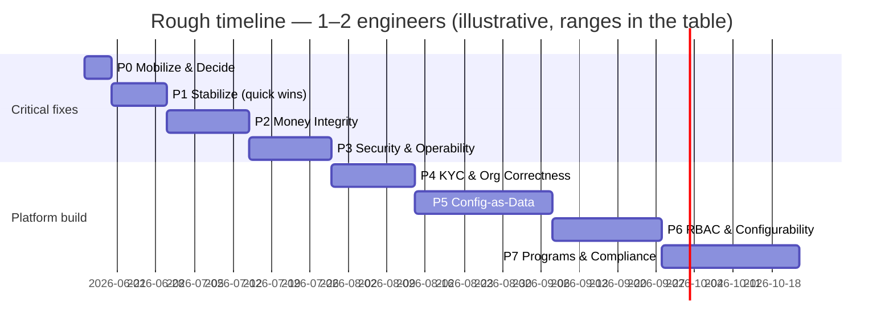

# Phased Execution Plan & Tracker

A shareable, trackable view of the whole remediation program. It **sequences** the work in
[`README.md`](README.md) (Milestones A–D, Epics E1–E4) into phases, maps every one of the 28
[gaps](../spec/gap-register.md) to a phase, and gives rough timelines. The detailed, bite-sized
tasks live in the milestone/epic files — this doc is the **tracking layer**, not a duplicate of them.

## How to track
- Update the **Status** and **Owner** columns in the master table as work moves.
- Status legend: `⬜ Not started` · `🟡 In progress` · `🟧 Blocked` · `✅ Done`.
- A phase is **Done** only when its **Exit criteria** are met (not just "code merged").

## Timeline assumptions (read before quoting dates)
- Estimates assume **1–2 engineers**, new to this codebase, ramping up (so early phases run slower).
- Ranges, not promises. A phase with migrations or an external dependency (proxy, owner decision)
  can slip. **Re-estimate at the start of each phase**, when you know more.
- **Total: ≈ 18–27 weeks (~4.5–6.5 months).** The first four phases (~7–11 weeks) clear the
  critical correctness/security gaps; phases 5–7 are larger platform investments.

## Master tracker

| Phase | Goal | Milestones / Epics | Gaps | Rough duration | Status | Owner |
|---|---|---|---|---|---|---|
| **P0** | Mobilize & lock decisions | Onboarding + Decision register | (decisions for #4,#5,#10,#12,#16,#22,#23,#24,#25) | ~1 wk | ⬜ | |
| **P1** | Stabilize / quick wins | Milestone A | #1, #21, ROLES, #11(doc), #15(note), #17(flag) | 1–2 wk | ⬜ | |
| **P2** | Money integrity | Milestones B + C | #16, #28, #7, #8, #19 | 2–3 wk | ⬜ | |
| **P3** | Security & operability | Milestone D | #20, #23, #26, #27, #24(policy) | 2–3 wk | ⬜ | |
| **P4** | Domain correctness: KYC & org | Epic E3 | #9, #11(impl), #12, #13, #14 | 2–3 wk | ⬜ | |
| **P5** | Config-as-data foundation | Epic E1 | #22, #18, #4(finalize) | 4–6 wk | ⬜ | |
| **P6** | RBAC & configurability | Epic E2 | #2, #3, #5, #17(impl) | 3–4 wk | ⬜ | |
| **P7** | Programs & compliance | Epic E4 | #6, #10(execute), #25 | 3–5 wk | ⬜ | |

## How to treat the EXISTING BUILD (important)

Account for the existing code at **two levels** — and the answer to "now vs at the phase" is *both,
but different things at each*:

**1. Portfolio level — already done, now.** The existing build *is* the baseline. The
[spec](../spec/README.md) documents it as-built, and the 28 gaps **are the delta** between what's
built and what's intended. You do **not** need a fresh full-codebase audit before starting — that
work is the spec/gap-register. Treat "what exists" as known at the planning level.

**2. Code level — just-in-time, at the start of each phase/task.** Do the *detailed* re-read of the
relevant code **when you pick up the phase**, not now, because:
- The spec is **reverse-engineered and can drift** — and the code keeps changing. **The running
  code is ground truth**, the spec is a (good) map. Every task already says "read this file / verify
  this assumption first" for exactly this reason.
- Deep-reading all ~90 models and ~113 routes up front is wasted effort for code you won't touch for
  months (YAGNI).

**Concretely, each phase starts with a short "build reconciliation" step** (½–1 day):
1. Re-verify the phase's gaps against today's code (the semantic spot-check) — has anything been
   fixed, moved, or made worse since the spec was written?
2. **Decide reuse-vs-replace** for the existing implementation in scope. The build is partly real,
   partly stubbed (`DEMO_MODE`), partly aspirational (e.g. the Scheme rule-engine). For each piece:
   extend it (DRY — like Milestone B reusing `creditPoints`), or replace it (like retiring
   `ROLE_PHONES`). Record the call in the PR.
3. Adjust the phase estimate with what you learned.

> Rule of thumb: **plan against the spec, build against the code.** If they disagree, the code wins
> and the spec gets corrected (the gap register is living).

## Per-phase detail

### P0 · Mobilize & lock decisions  (~1 wk)
- **Do:** engineers read [`00-onboarding`](00-onboarding.md) + [`01-how-we-test`](01-how-we-test.md);
  set up env + a board from the master table; resolve the **Decision register** below (or schedule
  each decision before its phase).
- **Exit:** environment runs; `npm test`/`tsc` clean on a fresh checkout; every High-impact decision
  is either made or has a named owner + due date.

### P1 · Stabilize / quick wins  (1–2 wk) — *Milestone A*
- **Scope:** domain refs (#1), dead `ROLES`, messaging-path decision (#21); plus cheap docs: sales
  enum note (#11), GST-type note (#15), visibility-mode flag stub (#17).
- **Exit:** Milestone A tasks merged; team has shipped the full branch→test→PR loop once.

### P2 · Money integrity  (2–3 wk) — *Milestones B + C*
- **Scope:** points credit the wallet (#16) + ledger follow-up (#28); separate-UTR enforcement (#7),
  invoice-number validation (#8), money-unit guard (#19).
- **Exit:** a confirmed POINTS batch raises wallet balances (verified on a real DB); Visibility pays
  on its own UTR; invoice numbers validated; pure logic unit-tested throughout.
- **Depends on:** P0 decision on wallet-less-outlet handling (#16).

### P3 · Security & operability  (2–3 wk) — *Milestone D*
- **Scope:** tenant-scoping audit + fixes (#23), token↔tenant binding design (#20, needs proxy
  owner); pagination on list endpoints (#26); observability baseline (#27); DPDP retention policy
  doc (#24).
- **Exit:** scoping audit green/allow-listed; isolation-enforcement approach chosen (D3 spike);
  pagination on the high-volume lists.

### P4 · Domain correctness: KYC & org  (2–3 wk) — *Epic E3*
- **Scope:** KYC routing via the reporting tree, retire `ROLE_PHONES` (#9); re-KYC trigger (#13);
  field-level rejection (#14); penny-drop decision execution (#12); derive role from
  `SalesHierarchyLevel` (#11 impl).
- **Exit:** approval routes off the real tree with escalation; pure `resolveApprover` unit-tested.
- **Depends on:** P0 decision on penny-drop (automate vs keep Excel).

### P5 · Config-as-data foundation  (4–6 wk) — *Epic E1*
- **Scope:** introduce a DB `Client` model + backfill from `CLIENT_REGISTRY` (#22); migrate the
  worst JSON-blob configs to relational (#18); finalize Partner/Outlet level binding (#4).
- **Exit:** tenant feature flags read from DB; a documented migration + rollback plan, dry-run on staging.
- **Risk:** highest-risk phase (touches every tenant-scoped query + a data migration). Coordinate with P3.

### P6 · RBAC & configurability  (3–4 wk) — *Epic E2*
- **Scope:** permission catalog from the capability list (#3); tenant-defined admin roles + `can()`
  enforcement (#2); "payout" rename for clarity (#5); visibility-mode flag wired (#17 impl).
- **Exit:** admin sections gated by configurable roles behind a flag; pure `can()` unit-tested.
- **Depends on:** P5 (roles are tenant config).

### P7 · Programs & compliance  (3–5 wk) — *Epic E4*
- **Scope:** per-activation enrollment forms + pre-fill (#6); execute the Scheme-engine keep/prune
  decision (#10); TDS section differentiation (#25).
- **Exit:** configurable activation forms live; tax sections correct per relationship type.
- **Depends on:** P5 (per-activation config).

## Decision register (lock in P0, or before the owning phase)

| Decision | Gap | Needed by | Owner | Status |
|---|---|---|---|---|
| Wallet-less outlet on points credit: skip+report vs auto-create wallet | #16 | P2 | | ⬜ |
| Keep or prune the Scheme rule-engine | #10 | P7 (decide early) | | ⬜ |
| Partner/Outlet: confirm 1:1-now / two-level-future binding | #4 | P5 | | ⬜ |
| Penny-drop: automate (bank API) vs keep Excel-batch | #12 | P4 | | ⬜ |
| Tenant isolation: Prisma extension vs Postgres RLS | #23 | P3 | | ⬜ |
| Config-as-data scope: which blobs migrate first | #18/#22 | P5 | | ⬜ |
| DPDP retention/erasure policy (hard-delete vs pseudonymise) | #24 | P3 | | ⬜ |
| TDS sections per relationship type (194R vs 194C/194J) | #25 | P7 | | ⬜ |
| Rename "payout" (CreditPayoutEntry vs PayoutTransaction)? | #5 | P6 | | ⬜ |
