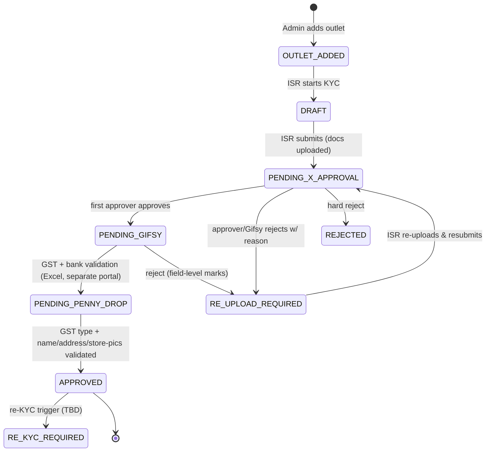
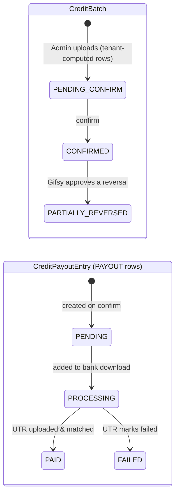
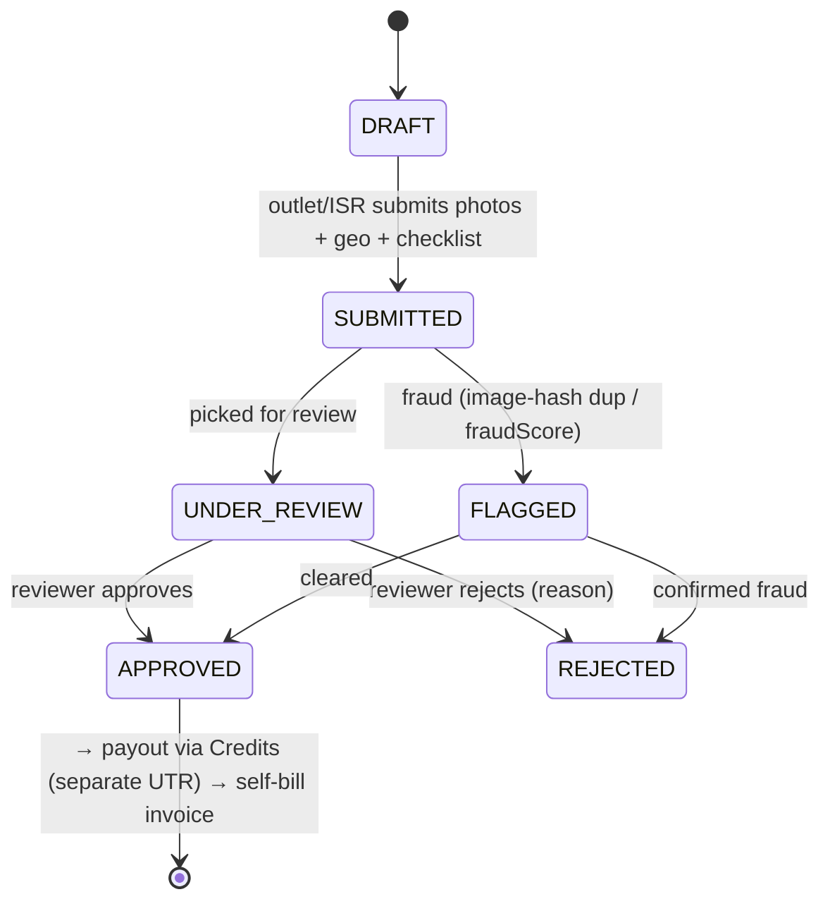
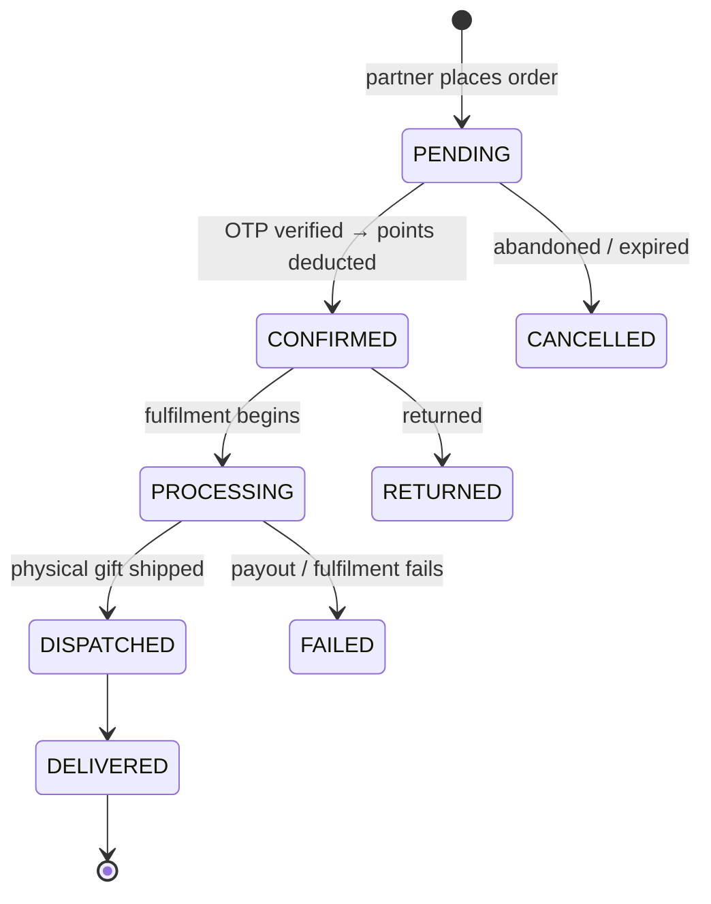
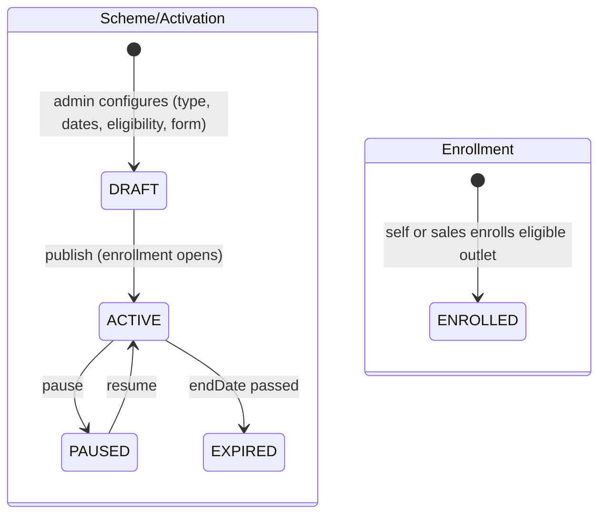
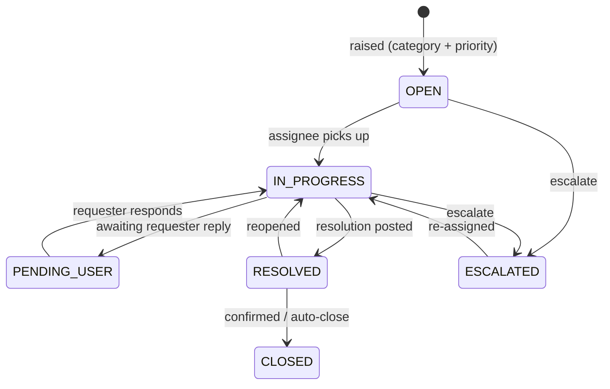

# Phase 2 — §02 Workflows & State Machines

Core end-to-end journeys. Each: **actors**, a **state machine**, the **happy-path narrative**,
**side effects**, and **gaps**. State machines use Mermaid (renders on GitHub / with a Mermaid
preview extension) plus a textual transition list.

Workflows covered: 0) Authentication & Session · 1) Outlet Onboarding & KYC · 2) Award → Wallet →
Payout · 3) Visibility → Self-Bill Invoice · 4) Points Redemption · 5) Activation Enrollment ·
6) Support Ticket.

---

## Workflow 0 — Authentication & Session (✅ P1)

**Actors.** User (any role) · Admin (phone-change) · Gifsy Ops (force-logout).

**Login (OTP flow):**
1. `POST /auth/send-otp` — MSG91 sends OTP to the phone registered under the tenant resolved from
   the subdomain (`x-tenant-slug`). Fails fast if no MSG91 template is configured for that tenant.
2. `POST /auth/verify-otp` — verifies OTP; on success: (a) writes a `UserSession` row with
   `clientId` set from the login subdomain and `expiresAt = now + 365d`; (b) bumps
   `lastLoginAt`/`loginCount` and writes a `LoginLog` entry; (c) issues a JWT carrying
   `{ userId, role, partnerId, clientId, sid }` (sid = session ID).
3. Every subsequent authenticated request: `getAuthUser` looks up the `UserSession` by token,
   rejects if revoked or idle-expired (`now > expiresAt`), bumps `expiresAt` (sliding 365-day
   idle), and — for non-Gifsy sessions — rejects if the subdomain doesn't match the session's
   `clientId` (header-swap defence). Returns `{ userId, role, partnerId, clientId, sid }`.

**Session lifecycle:**

| Action | Endpoint | Effect |
|---|---|---|
| Logout (this device) | `POST /auth/logout` | Revokes current `UserSession`; clears token cookie |
| Logout all devices | `POST /auth/logout-all` | Revokes all sessions for the calling user |
| Admin phone-change | `PATCH /admin/users/[id]` | Revokes all sessions for the edited user on actual phone change |
| Gifsy force-logout | `POST /admin/force-logout-all` | Global kill switch — revokes every active session across all tenants (GIFSY_ADMIN only; CLIENT_ADMIN gets 403) |

**Notes.**
- GIFSY_ADMIN sessions are exempt from the subdomain==tenant check (platform operator works
  cross-tenant).
- `DEMO_MODE` bypasses session validation (trusts proxy headers). **Never enable in production.**
- Phone-change revoke is wired for admin edits (P1). Wiring for bulk sales upload (P2) and
  re-KYC (P3) is deferred with TODO markers.

---

---

## Workflow 1 — Outlet Onboarding & KYC

**Actors.** Client Admin (adds outlet) · ISR (enrolls/KYC) · First approver = reporting
manager (SO/ASM/RSM…) · Gifsy Admin (final) · Partner (the onboarded outlet).

> `PENDING_X_APPROVAL` = one of `PENDING_SO_APPROVAL` / `PENDING_ASM_APPROVAL` /
> `PENDING_RSM_APPROVAL`, chosen at submit time by `initialKycStatus` (escalates up if the
> direct manager is inactive — resigned ⇒ blank phone).

**Narrative.** Admin adds the outlet → ISR opens KYC (`DRAFT`), uploads documents (S3),
submits → routed to the reporting manager (`PENDING_*_APPROVAL`). First approver approves →
`PENDING_GIFSY`.

**Gifsy validation sub-steps:** (1) **GST number + bank account (penny-drop)** validated via
**Excel upload in a separate validation portal**; (2) **GST registration type** recorded —
*Regular / Composition / Unregistered* — which **drives the visibility invoice GST logic (#12c)**;
(3) **name & address** validated against documents + **store pictures**. Then → **`APPROVED`**.
Reject → `RE_UPLOAD_REQUIRED` with **field-level markings** showing exactly which entries need
input; ISR fixes and re-enters the chain.

**Side effects at `APPROVED`** (`approve` route): submission `approvedAt` set · **`User.status
→ ACTIVE`** (login credentials live) · **Partner `Wallet` created** · audit log + status
history · `KYC_APPROVED` notification to partner.

**Gaps.**
- **GST + bank validation is an Excel-batch step in a separate portal**, not inline/automated
  penny-drop; `PENDING_AGREEMENT` enum state appears **unused** (→ Gap #12, refined).
- **Field-level rejection** is intended, but `reject` stores a single `rejectionReason` string
  (→ Gap #14).
- **GST registration type** captured here is a **dependency for visibility self-bill invoicing
  (#12c)** — formalize the link.
- First-approve checks **hardcoded SO/ASM/RSM**, not the reporting tree (Gap #9).
- **Escalation decided once at submit time**; mid-flow resignation not re-evaluated.
- **`RE_KYC_REQUIRED` trigger undefined** (→ Gap #13).
- `NOT_INTERESTED` (ISR marks outlet) → outlet deactivated (`OutletKycIntent`); terminal branch.

---

## Workflow 2 — Award → Wallet → Payout

**Actors.** Tenant (computes amounts **off-platform**) · Client Admin (uploads + confirms
batch) · Gifsy Admin (generates bank download, uploads UTR, approves reversals) · Partner
(sees credits in wallet).

**Narrative.** Tenant computes points/INR externally → Admin uploads a `CreditBatch`
(`PENDING_CONFIRM`); each row = outlet · **header** (`CreditField`) · amount · narration ·
`awardType` (`POINTS`|`PAYOUT`). Confirm → `CONFIRMED`: **PAYOUT** rows become
`CreditPayoutEntry` (`PENDING`) and Gifsy is notified (`ops@gifsy.in`). Gifsy generates a
`CreditPayoutDownload` (bank file) — entries **clubbed by group, Visibility separate**
(`isSeparatePayout`) — then uploads a **UTR Excel** (with **duplicate-UTR detection** across
the client) → entries `PAID`/`FAILED`, partner notified. Corrections flow through
`CreditReversal` (`PENDING_GIFSY` → `APPROVED`/`PARTIAL`/`REJECTED`) → batch
`PARTIALLY_REVERSED`.

**Side effects.** PAYOUT rows → payout entries + UTR settlement. Gifsy notification on confirm;
partner notification on UTR.

**Gaps.**
- **POINTS never reach the wallet (→ Gap #16, High).** Confirm only creates entries for PAYOUT
  rows; no `Wallet`/`PointsLedger` write anywhere in the credits module. The wallet view won't
  reflect uploaded points.
- **Reversal likely doesn't debit the wallet** either (same root cause) — verify.
- Clubbing vs separate-UTR depends on download grouping honoring `isSeparatePayout` (Gap #7).
- `CreditPayoutEntry.PROCESSING` transition point (download generation) to confirm.

---

## Workflow 3 — Visibility → Self-Bill Invoice

**Actors.** Outlet/ISR (submits store photos) · Reviewer (admin/Gifsy) · Client Admin (uploads
visibility payout amount) · Gifsy (UTR + self-bill invoice) · Outlet (views/edits invoice no.).

**Narrative.** Outlet/ISR submits store photos + geo + checklist (`VisibilitySubmission`,
`DRAFT`→`SUBMITTED`). Anti-fraud runs (image-hash dedupe via `VisibilityImageHash`,
`fraudScore`); suspicious → `FLAGGED`. Reviewer approves → `APPROVED` (or `REJECTED`).
**Payout** then follows the Award flow (#2) as a **Visibility `CreditField`** — always a
**separate UTR** (`isSeparatePayout`). On payment, Gifsy **self-bills** the outlet→Gifsy GST
invoice (`AutoInvoice`), with GST computed from the outlet's **GST registration type**
(Regular/Composition/Unregistered) captured at KYC (#12c). Outlet views + edits invoice number.

**Resolved — two configurable modes (per tenant):**
- **(A) App-capture mode** — outlet/ISR submits photos → fraud check → review/approve, for
  tenants wanting field-verified visibility (`VisibilitySubmission*`).
- **(B) Admin-upload mode** — admin uploads visibility payout amounts directly
  (`OutletVisibilityUploadBatch`/Credits), no photo flow.
- Both settle as a Visibility `CreditField` (**separate UTR**) + self-bill invoice. **Mode is a
  per-tenant setting** → Configurability Matrix.

**Gaps.**
- **No tenant config flag selects the visibility mode (A/B)** today (→ Gap #17).
- Mode A: approved submission → Credits payout → invoice is **not automated** (manual hand-off).
- `VisibilitySubmission.pointsAwarded` vs INR-via-Credits — confirm whether mode A awards points
  directly or always routes through Credits.

---

## Workflow 4 — Points Redemption

**Actors.** Partner (redeems) · System (OTP, wallet debit) · Gifsy/fulfilment (gift dispatch or
INR payout).

**Narrative.** Partner picks a reward from the catalogue → order created (`PENDING`,
`totalPointsCost` computed). **OTP confirm** (`REDEMPTION_CONFIRM`) → transaction checks
`wallet.redeemablePoints ≥ cost`, **deducts points**, order → `CONFIRMED`. Fulfilment by
`redemptionMode`: **PHYSICAL_GIFT/GIFT_CARD** → `PROCESSING`→`DISPATCHED`→`DELIVERED`;
**UPI/BANK_TRANSFER** (points→INR) → a `PayoutTransaction` (Redemption Payouts engine #12b,
paid from the client's prepaid `FundLedger`, with TDS). `CANCELLED`/`RETURNED`/`FAILED` branches.

**Side effects.** `wallet.redeemablePoints` debited on confirm; `RedemptionStatusHistory`
recorded; INR modes create a `PayoutTransaction` linked via `redemptionOrderId`.

**Gaps.**
- **Points IN-path missing (Gap #16):** redemption *debits* `redeemablePoints`, but nothing in
  the Credits flow *credits* them — so where balances originate is unresolved (manual adjust?).
- **Refund-on-cancel/return:** verify `CANCELLED`/`RETURNED`/`FAILED` re-credit points.
- **Holding/lock period** (`redeemablePoints` vs total; re-home the config off `TierConfig` — that model is
  DROPPED in P4.0) — document when points become redeemable (tenant-configurable, Phase 3).

---

## Workflow 5 — Activation Enrollment

**Actors.** Client Admin / Gifsy (define activation) · ISR (sales-enroll) or Outlet
(self-enroll) · System (eligibility + pre-fill).

**Narrative.** Admin/Gifsy defines a time-bound activation (`Scheme`: type, start/end,
`SchemeEligibility` audience by **program** (`Outlet.programName/programCategory`) + geo — replaces the legacy
class/tier targeting; enrollment-form config) → publish (`ACTIVE`).
Eligible outlets enroll — **self-enroll** (if allowed) or **sales-enroll** — via a
**configurable form** (variable fields); **loyalty/KYC'd outlets arrive with fields
pre-filled**, others fill from scratch → `SchemeEnrollment`. Participation runs to `endDate`;
**awards flow through the Credits upload (#2)**, not a scheme engine.

**Gaps.**
- **Configurable per-activation enrollment form not modeled** (`SchemeEnrollment` is just
  `schemeId,userId,status`); enrollment mode is **tenant-level**, not per-activation (Gap #6).
- **Conditional pre-fill** from the loyalty profile is intent, not built (Gap #6).
- **Loyalty (top/KYC, ongoing) vs Activation (all outlets, time-bound)** audience split to
  formalize. Non-KYC outlet participation depends on `nonKycOutletCampaigns`.

---

## Workflow 6 — Support Ticket

**Actors.** Partner / Sales (raise — self or **on-behalf**) · Admin / Gifsy (handle) · System
(escalation).

**Narrative.** Partner or sales raises a ticket (`TicketCategory`:
KYC/POINTS/REDEMPTION/PAYOUT/SCHEME/TECHNICAL/ACCOUNT/OTHER; `TicketPriority`
LOW→CRITICAL), optionally **on behalf** of an outlet. Threaded `TicketMessage` exchange;
`PENDING_USER` when awaiting the requester. Resolve → close. **Escalate**
(`api/tickets/[id]/escalate`) → `ESCALATED` for higher-tier/Gifsy handling. All transitions
in `TicketStatusHistory`.

**Gaps.**
- **SLA, assignment, and category→queue routing rules** are undefined.
- Escalation **target** (who receives an escalated ticket) to define.
- Auto-close policy for `RESOLVED` (timeout?) to define.
