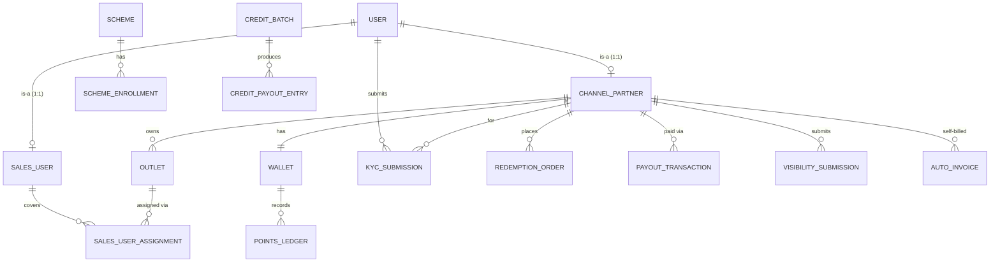
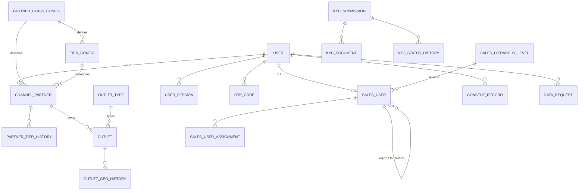
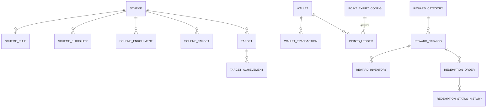
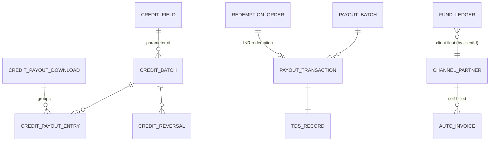
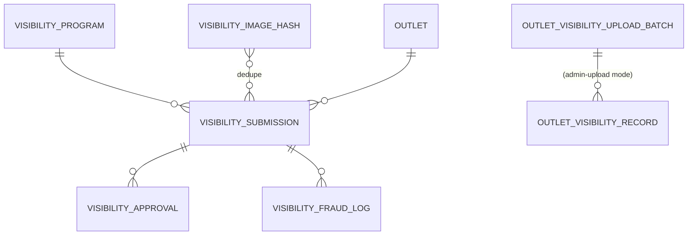

# Phase 2 — §03 Data Model

~90 Prisma models. Documented C4-style: a **high-level aggregate map**, then **per-cluster
ERDs**, then **cross-cutting data patterns & gaps**. Relationship notation: `||--o{` = one-to-
many, `||--||` = one-to-one, `}o--o{` = many-to-many. Lifecycles (status enums) live in §02.

---

## A · High-level aggregate map

`User` is the identity hub (tenant-scoped by `clientId`); it specialises into a Partner or a
Sales user. Value flows: Outlet → KYC → credentials; uploads → Credits → Wallet → Redemption.

---

## B · Per-cluster ERDs

### B1 · Identity, Partners, Sales, KYC

> **✅ P1 additions:**
> - `UserSession` gained `clientId String` (indexed, tenant bound at login from subdomain) and
>   `lastSeenAt DateTime?` (last-active display). `expiresAt` doubles as the 365-day idle sliding
>   marker (bumped on every validated request). Sessions are now actually written (previously the
>   model existed but had zero writers).
> - New `Client` model (`clients` table): `id = slug`, scalars `internalName`/`onboardedAt`, seven
>   JSON config blocks (`branding`, `features`, `partnerClasses`, `approvalHierarchy`, `notifications`,
>   `invoicing`, `wallet`), `status ClientStatus` enum (`ACTIVE`/`INACTIVE`/`ONBOARDING`). **No secret
>   columns** — `notifications` JSON excludes `msg91AuthKey` (kept in env/Secret Manager).
> - `FeatureFlags` gained `rbacEnforcement Boolean` (per-tenant opt-in for the RBAC engine;
>   off by default).

### B2 · Programs & Value (Schemes, Targets, Wallet, Rewards)

### B3 · Finance (Credits, Payouts, Invoicing)

> **Two payout entry types** (Gap #5): `CREDIT_PAYOUT_ENTRY` (push awards, `Decimal` INR) vs
> `PAYOUT_TRANSACTION` (pull redemptions, integer paise). See money-unit gap below.

### B4 · Visibility

---

## C · Cross-cutting data patterns & gaps

- **`clientId: String` denormalised on ~every table** for tenant scoping. **✅ P1 (gap #22
  addressed):** a `Client` model (id=slug, JSON config blocks, no secret) + `ClientStatus` enum
  now exist — the `clients` table is the DB home for tenant config. `getTenantConfig` reads the
  `Client` row; the in-code `CLIENT_REGISTRY` is the edge-safe fallback and migration seed.
  Note: `clientId` on other tables still has no FK to `Client` — DB-level FK enforcement is
  future work.
- **JSON-blob configs in `ProgramSetting`** (hierarchy, target-config, kpi-defs, banners, gifts)
  shadow relational models (`SalesUser`, `Target`, …). Two sources of truth per domain → drift
  (→ Gap #18). Decide blob vs relational per domain.
- **Inconsistent money units** — Payouts use **integer paise** (`amountPaise`), Credits use
  **`Decimal` INR** (`amountInr`, `totalPayoutInr`). Mixing risks rounding/conversion bugs at
  the Credits↔Payouts boundary (→ Gap #19).
- **Soft-delete (`deletedAt`)** on most aggregates but not all (e.g. ledger/history tables are
  append-only) — document the policy.
- **History/audit tables** are consistent and good: `*StatusHistory`, `AuditLog`, `LoginLog`,
  `*AuditLog` — append-only event trails per aggregate.
- **`Wallet` write-paths** — only redemption debits it; no credit path writes it (Gap #16).
