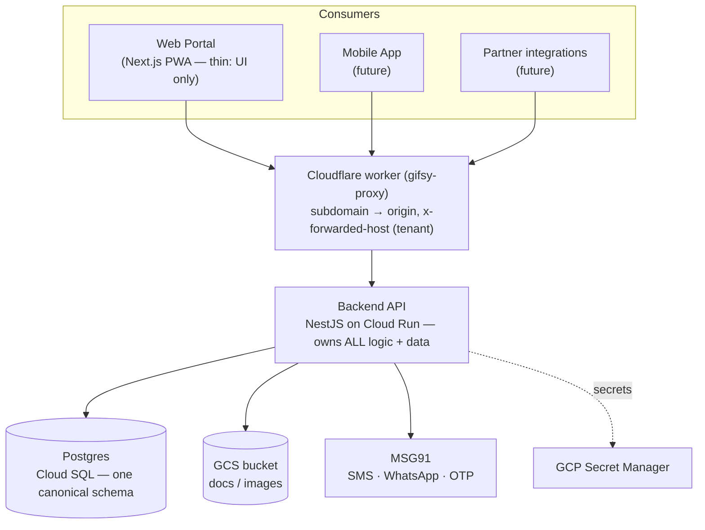

# Phase 2 — §04 Architecture & Cross-cutting (arc42 / C4)

## 1 · System context (C4 L1)

> **TARGET architecture (owner-decided 2026-06-16): API-first.** A dedicated **NestJS backend API** is the single
> source of truth (owns the DB + all business logic); the **Next.js web app is a thin client**, and future
> **mobile/PWA/partner** consumers are siblings calling the same API. The realignment from the current full-stack
> code is **Phase S** — see `../plans/BACKEND-SPLIT-PLAN.md` (why = Gap #31). Diagram shows the target.

## 2 · Building blocks (C4 L2)

> **Phase S — S1–S6 DONE (`../plans/BACKEND-SPLIT-PLAN.md`).** The target below **is built**: the NestJS backend
> lives in `api/` (api/'s World-A domain deleted; the real domain rebuilt from `platform/lib`), with **124 `/v1`
> endpoints across 17 modules**, a **66-model canonical schema** (`api/prisma/schema.prisma`, World-A de-scaffolded),
> and global envelope + JWT/permission/**tenant** guards. The storage/messaging integrations are now Nest services
> (`StorageService` over GCS; `NotificationsService` enqueue seam — see §5). **S5** added the app-layer `TenantGuard`
> (asserts a tenant is resolved per authed request + stamps `req.tenantId`; DB-level RLS is Gap #23 → P8.6). **S6**
> thinned the frontend: a `next.config.ts` proxy rewrites same-origin `/api/*` → backend `/v1/*` (the web client keeps
> calling `/api/*`; mobile/partner consumers will hit `/v1` directly). **S7** (infra) removed the dead cross-app
> prisma-schema fallback from the deploy workflows (`NEXT_PUBLIC_API_URL` was already plumbed — see §6). **S8** (cutover)
> proved the e2e path + confirmed `api/` clean; **Phase S is complete** and the FE is prod-deployable against the
> backend. **✅ RETIREMENT DONE (D2, `60b5a76`, 2026-06-20):** the 113 shadowed `src/app/api/*` handlers + the
> dead-transitive `lib` + `lib/prisma.ts` + `platform/prisma/` are deleted; the FE is now a pure proxy (the one live
> Prisma importer, `layout.tsx` tenant-config, was rewired to the in-code `CLIENT_REGISTRY`). The 16 unported Gap #32
> routes were wrong-model/retired (dropped) or ported (`admin/sales/*` → P4.5; `auth/logout` → stateless, D2).

**Target building blocks:**
- **Backend API (NestJS)** — the single source of truth: controllers (versioned `/v1`) over the ported domain
  services. Cross-cutting via global guards/interceptors: JWT+session auth, permission guard, **tenant-scoping
  guard** (one isolation enforcement point), throttling, audit, cron jobs. Owns Prisma → Postgres.
- **Domain logic (`lib/`)** — the platform's framework-agnostic logic (`kyc-approval`, `*-upload`,
  `credits-payouts-*`, RBAC `can`, sessions, hierarchy/outlet persistence) **moves into the backend** as services
  (only 3 `next/*`-coupled helpers are rewritten). This is the real-model foundation; the old `api/`'s domain is **not** reused.
- **Web frontend (Next.js)** — thin: UI + input + API calls + display only. **No business logic** (it may mirror
  validation for UX; the backend is authority). Portals: `gifsy/`, `admin/`, `sales/`, `partner/`.
- **Prisma** → Cloud SQL Postgres (one canonical schema, World-A de-scaffolded). **GCS** (`lib/s3.ts`, ADC) for
  docs/images + signed URLs. **MSG91** (`lib/msg91.ts`) for messaging/OTP. **Cloudflare worker** = edge proxy
  (subdomain→origin, `x-forwarded-host` carries tenant).

## 3 · Multi-tenancy & request lifecycle

> **The multi-tenant & per-client customization *model* (config-not-code-branches, customization spectrum,
> isolation enforcement, multi-consumer auth, now-vs-later effort) is owned by `06-configurability.md` §0.** This
> section covers the request mechanics.

- Subdomain `<slug>.gifsy.in` → edge proxy sets **`x-tenant-slug`** → used at login time to
  bind the tenant to the session (see §4). For pre-auth paths (`send-otp`, `verify-otp`)
  `getClientIdFromRequest` still reads `x-tenant-slug` directly.
- **✅ P1:** a `Client` model (id=slug) now exists in the DB — `getTenantConfig` reads the
  `Client` row first; the in-code `CLIENT_REGISTRY` is the edge-safe fallback (the edge proxy
  still uses the registry; no DB access at the edge). Tenant onboarding no longer requires a
  code change for config (gap #22 addressed).
- **Isolation = shared DB, row-level scoping** by the denormalised `clientId` string on every
  table. The 1.7 isolation audit test guards every tenant-scoped route. In the backend, the
  **`TenantGuard` (Phase S S5)** is the app-layer chokepoint — it asserts a tenant is resolved on
  every authenticated request (loud 403 vs a silent unscoped query) and stamps `req.tenantId` as the
  single seam DB-level enforcement will hook. No Postgres RLS / Prisma auto-scoper yet — measured-and-
  deferred to **P8.6** (gap #23 residual: ~28 relation-scoped + 41 id-only of 236 query sites carry no
  direct `clientId`, so a strict assert must land *with* RLS + a cross-tenant escape-hatch taxonomy).

## 4 · Authentication & authorization

- **AuthN:** OTP (MSG91) → JWT (`userId, role, partnerId, clientId, sid`). Two-layer gate:
  - **Edge proxy (coarse, fast):** JWT signature verify + role-route check + inject
    `x-user-id`/`x-user-role`/`x-tenant-slug`. No DB access. `JWT_SECRET` refuses to start if
    missing in prod.
  - **App layer `getAuthUser` (fine, ✅ P1 upgraded):** validates the persisted `UserSession`
    (revoked? idle-expired? wrong tenant?) on every authenticated request. Returns
    `{ userId, role, partnerId, clientId, sid }` sourced from the session row. Also **enforces
    subdomain==session-tenant for non-Gifsy** requests — a valid token used on the wrong
    subdomain is rejected, closing the header-swap attack (gap #23) and the proxy-trust gap (#20).
    GIFSY_ADMIN is exempt (platform operator works cross-tenant).
  - `DEMO_MODE` bypasses session validation (trusts proxy headers) — **never enable in prod**.
- **Session lifecycle (✅ P1):** `verify-otp` creates a `UserSession` with `clientId` set from
  the login subdomain and `expiresAt = now + 365d`. Every validated request bumps `expiresAt`
  (sliding idle). Sessions are revocable immediately (logout, logout-all, admin phone-change,
  GIFSY kill-switch force-logout-all).
- **AuthZ (✅ P1 engine done, wiring flag-gated):** `lib/rbac/can.ts` — 71-permission catalog /
  17 groups; default role→permission map (GIFSY_ADMIN=all; CLIENT_ADMIN=all except
  `GIFSY_OPERATED_PERMISSIONS`; MIS_USER=read-only; Sales/Partner=portal-scoped). Per-tenant
  overrides supported. `requirePermission` wired into all 44 admin route files — **additive,
  flag-gated off by default** (env `RBAC_ENFORCEMENT` + per-tenant `features.rbacEnforcement`).
  Consult pre-activation checklist in `reconcile/P1-identity-tenancy.md` before enabling.

## 5 · Integrations

| Integration | Lib | Notes |
|---|---|---|
| Object storage | `lib/s3.ts` (GCS) → backend **`StorageService`** (Phase S S3) | ADC on Cloud Run; signed URLs need `serviceAccountTokenCreator`; `generateKey`/`uploadFile`/`getSignedUrl` |
| Messaging/OTP | `lib/msg91.ts` | WhatsApp/SMS/OTP; `DEMO_MODE` simulates |
| Notifications | `lib/notifications.ts` → backend **`NotificationsService`** (enqueue seam, S3) | DB template/queue model **kept**; Phase S S3 added `NotificationsService.enqueue` (writes QUEUED `NotificationQueue` rows). Delivery worker + retire axios/`nodemailer` (MSG91 sole provider) = **P7** (Gap #21) |
| Payments | — | **No gateway integrated**; `PayoutTransaction.provider*` unused → payouts are **offline** (bank file + UTR) |

## 6 · Deployment

- **Target (Phase S):** **Docker → Cloud Run** for **two** services — the **backend API** (`gifsy-api`; owns the
  DB, gets `DATABASE_URL`/Cloud SQL/secrets; reaches the private-IP Cloud SQL over **Direct VPC egress** — no Redis,
  no VPC connector; see `../plans/INFRA-ARCHITECTURE.md`) + the **thin web frontend** (`gifsy-frontend`; stateless; takes
  **`NEXT_PUBLIC_API_URL`** = backend origin so its `next.config.ts` proxy can forward `/api/*` → `/v1/*` — already
  plumbed: `Dockerfile` `ARG`→`ENV` bakes it at `next build`, deploy workflows pass it via `--build-arg` from the
  `NEXT_PUBLIC_API_URL`/`_STAGING` secrets; `JWT_SECRET` only while the shadowed local `src/app/api/*` routes still
  exist, removed at S8). This is exactly what `terraform/` already provisions — the split makes the **code** match it.
  **Cloud SQL** Postgres (one canonical schema); **GCS**; **Secret Manager** (`JWT_SECRET`, MSG91 keys — never
  hardcoded; SA key files gitignored); `terraform/iam.tf`. **Cloudflare worker** routes subdomains to origins.
- **Schema ownership:** the **backend** (which lives in the `api/` dir post-split) owns the single canonical Prisma
  schema. The split-brain (two schemas, `platform` 80 vs `api` 74) is **resolved by Phase S** — the platform schema
  is de-scaffolded and becomes `api/prisma/schema.prisma` (replacing api's World-A 74-model schema); one schema
  remains (Gap #30).
- `DEMO_MODE=true` short-circuits external deps (DB/MSG91/approvals) for end-to-end demo — **never in prod**.

## 7 · Cross-cutting concerns

- **Audit/event trails:** `AuditLog`, `LoginLog`, `*StatusHistory` (append-only).
- **Notifications:** templated, queued (`NotificationQueue` + `DeliveryLog`), multi-channel.
- **Soft-delete:** `deletedAt` on aggregates; ledgers append-only.
- **Testing:** Vitest; pure `lib/` functions unit-tested; some route + page-wiring tests.
- **i18n:** `User.preferredLanguage`; partner-facing localisation.

## 8 · Architecture risks / gaps

- **→ Gap #31 — ✅ DECIDED (2026-06-16), resolving via Phase S:** the code was built **full-stack** while
  `terraform/` deploys a **stateless frontend + NestJS `api/` as DB owner** (platform had NO prod `DATABASE_URL` →
  couldn't run in prod). **Owner decision:** adopt the **dedicated-backend (API-first)** architecture — build the
  backend from the **platform's real-model `lib/`+schema** (not the World-A `api/` domain, which is deleted — though
  `api/`'s framework **shell** is reused in place as the deploy target), frontend goes thin. Done **now** (greenfield,
  P2 = cheapest). Gates P3+. Full plan: `../plans/BACKEND-SPLIT-PLAN.md`.

- **→ Gap #20 — ✅ RESOLVED (P1 S3–S4b):** `clientId`+`sid` are now in the JWT, bound to a
  server-side `UserSession`. `getAuthUser` validates the session and enforces
  subdomain==session-tenant in-app, independent of the proxy.
- **→ Gap #21 (Low, DECIDED 0.4c):** MSG91 is the sole provider (SMS/OTP/WhatsApp/email); retire
  `notifications.ts`'s axios senders + `nodemailer`, keep its DB template/queue model. Build in P7.
- **→ Gap #22 — ✅ ADDRESSED (P1 1.3/1.4):** `Client` model in DB; `getTenantConfig` reads it.
  Registry remains as edge-safe fallback. Admin config UI deferred (coordinate with UX revamp).
- **→ Gap #23 — ◐ REDUCED (P1):** header-swap closed (S4b); per-route `clientId` scoping fixed
  (1.2a/1.7); isolation audit test guarding missed filters. Residual: still per-query discipline;
  no Postgres RLS / Prisma auto-scoping (future — P8.6).
- **Config-in-code** (`CLIENT_REGISTRY`) is now the edge-only fallback; DB-backed config is live
  for app-layer requests.
