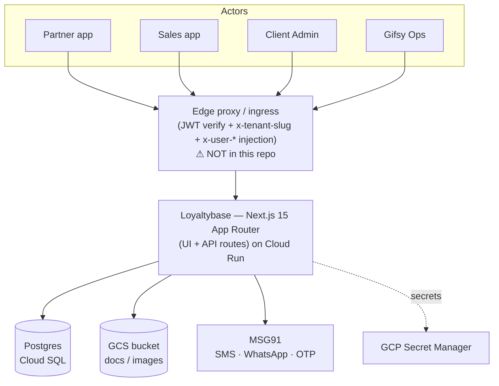

# Phase 2 — §04 Architecture & Cross-cutting (arc42 / C4)

## 1 · System context (C4 L1)

## 2 · Building blocks (C4 L2)

- **Next.js 15 App Router** — co-located UI (`src/app/<portal>/…`) and API (`src/app/api/…`).
  Four portal route-groups: `gifsy/`, `admin/`, `sales/`, `partner/`.
- **`lib/`** — domain logic, mostly **pure + testable** (e.g. `kyc-approval`, `*-upload`,
  `credits-payouts-*`), separated from side-effectful callers (Prisma, GCS, MSG91).
- **Prisma** → Cloud SQL Postgres. **GCS** (`lib/s3.ts`, ADC service account) for documents/
  images + signed URLs. **MSG91** (`lib/msg91.ts`) for messaging/OTP.

## 3 · Multi-tenancy & request lifecycle

- Subdomain `<slug>.gifsy.in` → edge proxy sets **`x-tenant-slug`** → `getClientIdFromRequest`
  → **`clientId`**; falls back to `DEFAULT_CLIENT_ID = 'deoleo'` if absent.
- **Isolation = shared DB, row-level scoping** by the denormalised `clientId` string on every
  table. No `Client` model/FK; per-tenant config in the code `CLIENT_REGISTRY`.

## 4 · Authentication & authorization

- **AuthN:** OTP (MSG91) → JWT (`userId, role, partnerId`). `getAuthUser` trusts
  proxy-injected `x-user-id`/`x-user-role` **or** falls back to `Authorization: Bearer`.
  **JWT verification is expected at the proxy**; `JWT_SECRET` refuses missing in prod.
- **`clientId` is NOT in the token** — tenant comes from the host header. Token↔tenant binding
  depends on the (external) proxy (→ Gap #20).
- **AuthZ:** coarse inline role checks today; **target = configurable admin RBAC** (Gap #2).

## 5 · Integrations

| Integration | Lib | Notes |
|---|---|---|
| Object storage | `lib/s3.ts` (**GCS**, name is legacy) | ADC on Cloud Run; signed URLs need `serviceAccountTokenCreator` |
| Messaging/OTP | `lib/msg91.ts` | WhatsApp/SMS/OTP; `DEMO_MODE` simulates |
| Notifications | `lib/notifications.ts` | **Generic SMS/WhatsApp gateway env vars — second path, may overlap MSG91** (→ Gap #21) |
| Payments | — | **No gateway integrated**; `PayoutTransaction.provider*` unused → payouts are **offline** (bank file + UTR) |

## 6 · Deployment

- **Docker → Cloud Run**; **Cloud SQL** Postgres; **GCS** bucket; **Secret Manager**
  (`JWT_SECRET`, MSG91 keys — never hardcoded; SA key files gitignored); `terraform/iam.tf`.
- `DEMO_MODE=true` short-circuits external deps (DB/MSG91/approvals) for end-to-end demo.

## 7 · Cross-cutting concerns

- **Audit/event trails:** `AuditLog`, `LoginLog`, `*StatusHistory` (append-only).
- **Notifications:** templated, queued (`NotificationQueue` + `DeliveryLog`), multi-channel.
- **Soft-delete:** `deletedAt` on aggregates; ledgers append-only.
- **Testing:** Vitest; pure `lib/` functions unit-tested; some route + page-wiring tests.
- **i18n:** `User.preferredLanguage`; partner-facing localisation.

## 8 · Architecture risks / gaps

- **→ Gap #20 (High):** the security boundary (JWT verify + tenant binding) lives in an **edge
  proxy not in this repo**. Without it, fallbacks apply (`DEFAULT_CLIENT_ID`, Bearer) — a valid
  token on the wrong subdomain could mismatch tenant scope. Verify the proxy exists + binds them.
- **→ Gap #21 (Low):** two messaging paths (`msg91.ts` vs `notifications.ts` generic gateway) —
  pick the canonical one.
- **Config-in-code** (`CLIENT_REGISTRY`) means tenant onboarding is a code deploy, not data
  (ties to Gap #2 / tenancy).
