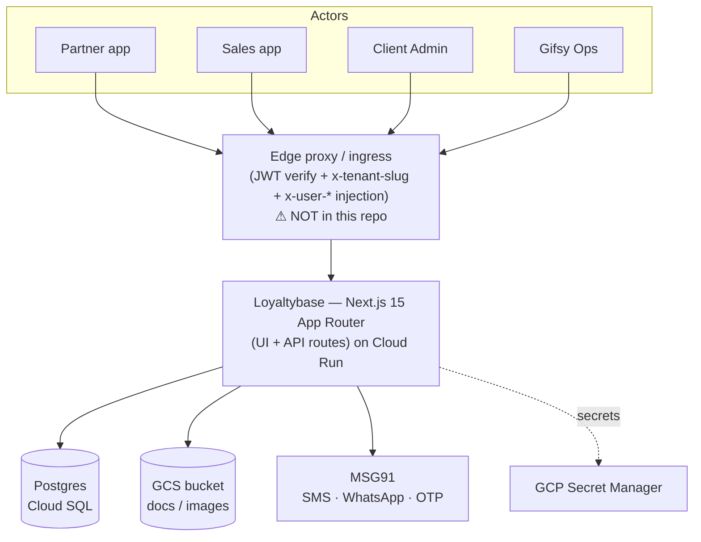

# Phase 2 — §04 Architecture & Cross-cutting (arc42 / C4)

## 1 · System context (C4 L1)

## 2 · Building blocks (C4 L2)

> **⚠️ Two deployed services in this repo (2026-06-16).** The git root holds **two** apps, both deployed to
> Cloud Run by `deploy.yml`: **`platform/`** (Next.js — *this spec covers it*, the app we build on) and
> **`api/`** (a separate NestJS service). **Each has its OWN Prisma schema.** `platform/prisma/schema.prisma`
> (80 models) is the **source of truth for the platform** — used by local dev (`prisma.config.ts`), the
> platform Dockerfile, CI, and the dev DB (`gifsy_dev`). `api/prisma/schema.prisma` (74 models) is the api
> service's own, separate schema (missing the platform's `Client` model + Credits module — they're not the
> same schema). Don't cross-wire them. (A stale "platform has no prisma/schema.prisma" note in the CI/deploy
> workflows was fixed in the 2026-06-16 CI-schema reconcile; see §6 + Gap #30.)

- **Next.js 16 App Router** — co-located UI (`src/app/<portal>/…`) and API (`src/app/api/…`).
  Four portal route-groups: `gifsy/`, `admin/`, `sales/`, `partner/`.
- **`lib/`** — domain logic, mostly **pure + testable** (e.g. `kyc-approval`, `*-upload`,
  `credits-payouts-*`), separated from side-effectful callers (Prisma, GCS, MSG91).
- **Prisma** → Cloud SQL Postgres. **GCS** (`lib/s3.ts`, ADC service account) for documents/
  images + signed URLs. **MSG91** (`lib/msg91.ts`) for messaging/OTP.

## 3 · Multi-tenancy & request lifecycle

- Subdomain `<slug>.gifsy.in` → edge proxy sets **`x-tenant-slug`** → used at login time to
  bind the tenant to the session (see §4). For pre-auth paths (`send-otp`, `verify-otp`)
  `getClientIdFromRequest` still reads `x-tenant-slug` directly.
- **✅ P1:** a `Client` model (id=slug) now exists in the DB — `getTenantConfig` reads the
  `Client` row first; the in-code `CLIENT_REGISTRY` is the edge-safe fallback (the edge proxy
  still uses the registry; no DB access at the edge). Tenant onboarding no longer requires a
  code change for config (gap #22 addressed).
- **Isolation = shared DB, row-level scoping** by the denormalised `clientId` string on every
  table. The 1.7 isolation audit test guards every tenant-scoped route. No Postgres RLS yet
  (future hardening — gap #23 residual).

## 4 · Authentication & authorization

- **AuthN:** OTP (MSG91) → JWT (`userId, role, partnerId, clientId, sid`). Two-layer gate:
  - **Edge proxy (coarse, fast):** JWT signature verify + role-route check + inject
    `x-user-id`/`x-user-role`/`x-tenant-slug`. No DB access. `JWT_SECRET` refuses to start if
    missing in prod.
  - **App layer `getAuthUser` (fine, ✅ P1 upgraded):** validates the persisted `UserSession`
    (revoked? idle-expired? wrong tenant?) on every authenticated request. Returns
    `{ userId, role, partnerId, clientId, sid }` sourced from the session row. Also **enforces
    subdomain==session-tenant for non-Gifsy** requests — a valid token used on the wrong
    subdomain is rejected, closing the header-swap attack (gap #23) and the proxy-trust gap (#20).
    GIFSY_ADMIN is exempt (platform operator works cross-tenant).
  - `DEMO_MODE` bypasses session validation (trusts proxy headers) — **never enable in prod**.
- **Session lifecycle (✅ P1):** `verify-otp` creates a `UserSession` with `clientId` set from
  the login subdomain and `expiresAt = now + 365d`. Every validated request bumps `expiresAt`
  (sliding idle). Sessions are revocable immediately (logout, logout-all, admin phone-change,
  GIFSY kill-switch force-logout-all).
- **AuthZ (✅ P1 engine done, wiring flag-gated):** `lib/rbac/can.ts` — 71-permission catalog /
  17 groups; default role→permission map (GIFSY_ADMIN=all; CLIENT_ADMIN=all except
  `GIFSY_OPERATED_PERMISSIONS`; MIS_USER=read-only; Sales/Partner=portal-scoped). Per-tenant
  overrides supported. `requirePermission` wired into all 44 admin route files — **additive,
  flag-gated off by default** (env `RBAC_ENFORCEMENT` + per-tenant `features.rbacEnforcement`).
  Consult pre-activation checklist in `reconcile/P1-identity-tenancy.md` before enabling.

## 5 · Integrations

| Integration | Lib | Notes |
|---|---|---|
| Object storage | `lib/s3.ts` (**GCS**, name is legacy) | ADC on Cloud Run; signed URLs need `serviceAccountTokenCreator` |
| Messaging/OTP | `lib/msg91.ts` | WhatsApp/SMS/OTP; `DEMO_MODE` simulates |
| Notifications | `lib/notifications.ts` | DB template/queue model **kept**; its generic axios senders + `nodemailer` to be **retired** — MSG91 is the sole provider (Gap #21 **DECIDED** 0.4c; build in P7) |
| Payments | — | **No gateway integrated**; `PayoutTransaction.provider*` unused → payouts are **offline** (bank file + UTR) |

## 6 · Deployment

- **Docker → Cloud Run** for **both** services (`platform` + `api`); **Cloud SQL** Postgres; **GCS** bucket;
  **Secret Manager** (`JWT_SECRET`, MSG91 keys — never hardcoded; SA key files gitignored); `terraform/iam.tf`.
- **Prisma client generation** (CI `ci.yml`, deploy `deploy.yml`/`deploy-staging.yml`, and `platform/Dockerfile`)
  generates each app's client from **its own `prisma/schema.prisma`** (`npx prisma generate` per app dir).
  ⚠️ Earlier the platform-test step hardcoded `--schema=../api/prisma/schema.prisma` (generated the platform
  client from api's stale schema → platform `tsc` failed in CI; latent since P1). **Fixed 2026-06-16.**
- **Open (P9):** confirm whether `platform` + `api` share one **prod** DB (`gifsy-db`). If they do, the two
  diverged schemas (80 vs 74 models) need a migration-ownership decision. Dev is clean (`gifsy_dev` = platform's
  own DB, built from the platform schema). See Gap #30.
- `DEMO_MODE=true` short-circuits external deps (DB/MSG91/approvals) for end-to-end demo.

## 7 · Cross-cutting concerns

- **Audit/event trails:** `AuditLog`, `LoginLog`, `*StatusHistory` (append-only).
- **Notifications:** templated, queued (`NotificationQueue` + `DeliveryLog`), multi-channel.
- **Soft-delete:** `deletedAt` on aggregates; ledgers append-only.
- **Testing:** Vitest; pure `lib/` functions unit-tested; some route + page-wiring tests.
- **i18n:** `User.preferredLanguage`; partner-facing localisation.

## 8 · Architecture risks / gaps

- **→ Gap #20 — ✅ RESOLVED (P1 S3–S4b):** `clientId`+`sid` are now in the JWT, bound to a
  server-side `UserSession`. `getAuthUser` validates the session and enforces
  subdomain==session-tenant in-app, independent of the proxy.
- **→ Gap #21 (Low, DECIDED 0.4c):** MSG91 is the sole provider (SMS/OTP/WhatsApp/email); retire
  `notifications.ts`'s axios senders + `nodemailer`, keep its DB template/queue model. Build in P7.
- **→ Gap #22 — ✅ ADDRESSED (P1 1.3/1.4):** `Client` model in DB; `getTenantConfig` reads it.
  Registry remains as edge-safe fallback. Admin config UI deferred (coordinate with UX revamp).
- **→ Gap #23 — ◐ REDUCED (P1):** header-swap closed (S4b); per-route `clientId` scoping fixed
  (1.2a/1.7); isolation audit test guarding missed filters. Residual: still per-query discipline;
  no Postgres RLS / Prisma auto-scoping (future — P8.6).
- **Config-in-code** (`CLIENT_REGISTRY`) is now the edge-only fallback; DB-backed config is live
  for app-layer requests.
